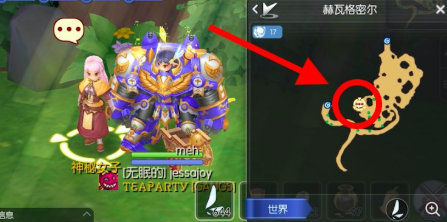
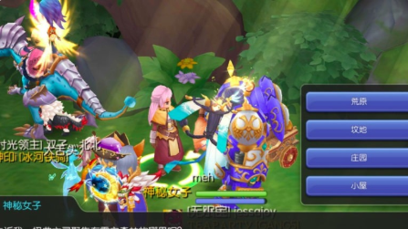
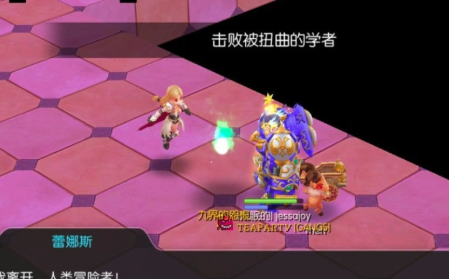
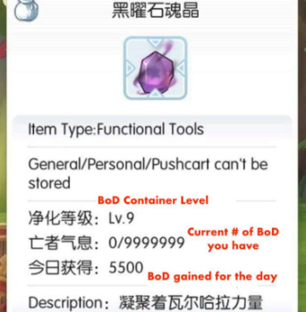
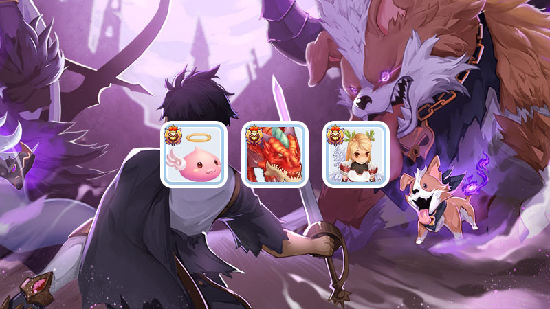
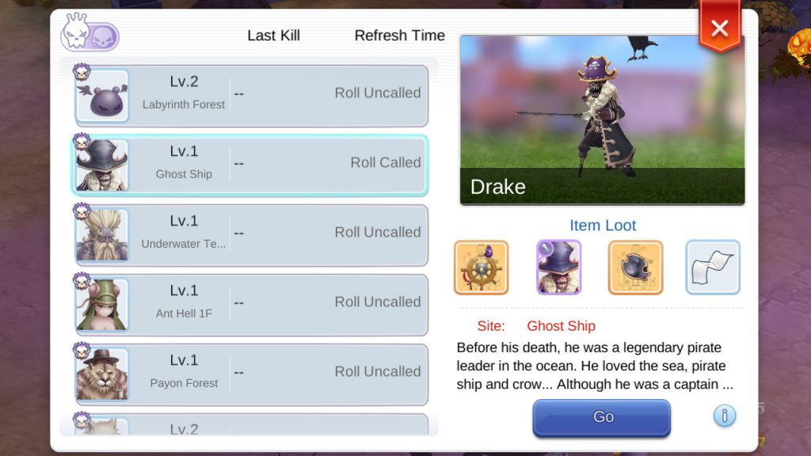
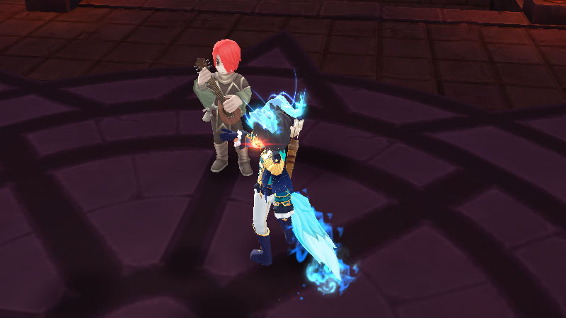
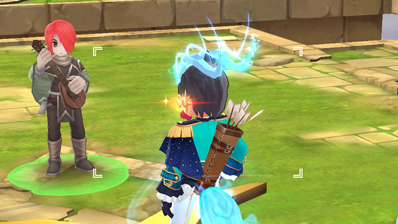

# Как разблокировать прорыв в 3-ей профессии (41-60 джоб)

С выходом 5 Эпизода, можно будет на 3й профессии увеличить свой профессиональный уровень с 40 до 60.

Для начала надо выполнить квест, который откроет возможность, собирать "Дыхание смерти".

Квест на прорыв профессии начинается в Умбале, в новом городе.

Чтобы попасть в Умбалу, из Моррока идем на юг, потом 2 раза на запад.

Оказавшись в Умбале, надо поговорить с NPC для начала квестовой цепочки.

Также нужно будет поговорить с некоторыми NPC в Нифельхейме. Этот город находится на севере области Умбалы.

NPC в Умбале может задать несколько вопросов, ответы — 2й вариант, 1й вариант, 3й вариант.

Остальную часть квеста придется походить по разным городам, поговорить с разными NPC, активировать несколько предметов и убить монстров.

## Как увеличить прорыв 3-ей профессии Дыханиями смерти

После выполнения квеста в Умбале, вы получите предмет "Функциональный инструмент" в котором будут хранится "Дыхание смерти".

В дальнейшем вам нужно будет собирать "Дыхание Смерти", чтобы увеличить лимит профессии.

Существует 5 способов получить "Дыхание Смерти":
1. Ежедневные квесты в Нифельхейме.
2. Мировые MVP.
3. Нежить MVP (UMVP).
4. UMVP в Бесконечной Башне на 101 этаже.
5. UMVP в 100 Валькирии.

## 1. Ежедневные квесты в Нифельхейме.

Вы можете выполнить ежедневные квесты в городе Нифельхейм, за выполнение которых можно получить 1500 дыханий смерти в день.

## 2. Мировые боссы.

Мировые боссы — новый тип MVP. В игре есть три Мировых MVP: Ангелинг, Валькирия Саннгрид и Детардеврус.

Они появляются каждые 2 часа на случайной карте Нифельхейма и на произвольном канале.

Из них выпадает "Дыхание Смерти" и другие предметы, которые получают все участники сражения.

Если MVP появится, вы увидите иконку с черепом рядом с вашей мини картой. Нажмите на неё и вы увидите местоположение MVP. У игроков есть 30 минут на убийство MVP.

Менять каналы можно, вы не будете попадать по MVP, но всё равно получите "Дыхание смерти". Вам надо иметь зеленую или желтую стамину. Вы можете не быть MVP, главное находиться вблизи MVP. Если MVP в зоне видимости при его смерти вы получите 500 "Дыхания Смерти".

## 3. Возрожденный MVP (UMVP).

Возрожденный MVP (UMVP) — более сильная версия обычного MVP. Они имеют более высокое значение HP и имеют элемент Нежити, но имеют ту же расу, что и оригинал.

Вам нужно убить UMVP в течение 15 минут, если не успели, то вместо него появится обычный аналог MVP.

После убийста UMVP вы получите "Дыхание Смерти" и дополнительный лут.

Откройте список MVP и переключите на список UMVP для просмотра списка UMVP.

## 4. UMVP в Бесконечной Башне.

После очистки 100 Этажа Бесконечной Башни появится NPC Темный Менестрель. Поговорите с ним, чтобы призвать UMVP.

У вас только ОДНА попытка, если вы умрёте, то повторить сможете только на следующей неделе. Можно убить 2 UMVP.

За победу над UMVP вы получите 5000 "Дыханий Смерти" (в общей сумме 10000)

## 5. UMVP в руинах Вальхаллы.

Войдите в Вальхаллу 100 лвл и очистите первую карту. Появится NPC Темный Менестрель, поговорив с которым можно призвать UMVP. Если вы умрёте, то повторить сможете на следующей неделе.

За победу над UMVP вы получите 5000 "Дыхание Смерти"

- Если поблизости есть портал на соседнюю локацию, обязательно поставте там игрока с дальней атакой, чтобы безопасно атаковать UMVP.
- Оставьте хотя бы одного члена пати в безопасной зоне, в случае смерти можно будет перезайти.

Сколько "Дыханий смерти" необходимо для прорыва:

|Job lvl|Уровень контейнера|Дыхания смерти|
|-|-|-|
|41|1|500|
|42|2|900|
|43|3|1400|
|44|4|2000|
|45|5|2500|
|46|6|3200|
|47|7|3900|
|48|8|4600|
|49|9|5500|
|50|10|6500|
|51|11|7600|
|52|12|8800|
|53|13|10100|
|54|14|11600|
|55|15|13300|
|56|16|15100|
|57|17|17100|
|58|18|19300|
|59|19|21800|
|60|20|24400|
||всего|180100|

*автор — Димбо*
