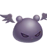
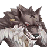
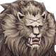

<h1 id="revenant-mvps-возрождённый-mvp">Revenant MVPs (Возрождённый MVP)</h1>

В данном гайде будут описаны RMVP, которые были введены в 5 эпизоде. Данные MVP могут встретиться:

<ul>
<li>В поле</li>
<li>В Бесконечной Башне (после зачистки 100 этажа)</li>
<li>В Руинах Вальгаллы 100 (после зачистки самой первой локации)</li>
<li>В Сложном подземелье Оракула (???)</li>
</ul>

<strong>Все эти RMVP по элементу - Нежить, а по расе - как их оригинальный вариант.</strong> Бить нужно исключительно огненным или святым элементом.

<h1 id="призыв-rmvp-в-поле">Призыв RMVP в поле</h1>

В списке МВП вместо обычного появляется его андед версия (фиолетовая) и написано Appeared.

Нужно идти на лоску с ним, где есть 3 варианта:

<ol>
<li><strong>На карте лежат НПЦ, которые притворяются мёртвыми.</strong> Необходимо, чтобы ещё 5 человек на карте (любых) притворились мертвыми.</li>
<li><strong>На карте много хоронгов.</strong> Необходимо убить несколько хоронгов, чтобы выбить лут и принести его НПЦ Оливеру, который стоит где-то на карте.</li>
<li><strong>Если нет ни “мёртвых” НПЦ, ни хоронгов.</strong> На карте стоит скелет с мушкетом. Нужно просто поговорить с ним.</li>
</ol>

После одного из трёх действий появляется RMVP, которого надо убить. Всего на призвание и убийство есть полчаса. Если не успели - RMVP заменяется своей обычной версией. Получение лута и статуса MVP на RMVP схож с обычными процедурами получения этого статуса на обычных MVP. Death Breath даётся только человеку, ставшему MVP.

<h1 id="описание-умений-rmvp-и-способы-убийства">Описание умений RMVP и способы убийства</h1>

|RMVP|Умения|Стратегия|
|-|-|-|
|Доппельгангер  Undead Demon M [romcodex](https://www.romcodex.com/monster/204000/doppelganger)|1. Вечное молчание (пассивка) 2. Солнечный удар (часто); 3. Инстакилл АоЕ (часто, но долгий каст тайм); 4. Магнум (АоЕ дамаг и отброс); 5. Спираль (средний урон по одиночной цели); 6. Урон, завясящий от SP Допеля (очень слабый); 7. Сильный удар (вызывает замедление); 8. Саммон.|Необходимо стоять далеко от него, когда она кастует Солнечный удар (долгий каст). Можно сбить провокацией. СВ спасает от прочего входящего дамага. У кастеров могут быть проблемы из-за молчанки.|
|Дрейк  Undead Undead M [romcodex](https://www.romcodex.com/monster/204030/drake)|1. Вечное молчание (пассивка); 2. Вечное время каста (пассивка); 3. Солнечный удар (часто); 4. Контратака (100% крит); 5. Боулинг Баш (чем больше человек вокруг, тем больше урон); 6. Яд АоЕ; 7. Черная дыра (полная иммобилизация и снятие баффов); 8. Саммон (много ХП, могут морозить/превращать в камень).|Босс, против которого визам играть очень тяжело. Основаная сила против него - ханты, которые бьют его автоатакой. Визы могут помогать морозить его миньонов с помощью Frost Nova.|
|Девилинг  Undead Demon M [romcodex](https://www.romcodex.com/monster/204020/deviling)|1. Солнечный удар (часто); 2. Метеор (АоЕ урон и слепота); 3. Большой дарк урон по одиночной цели; 4. Черная дыра (полная иммобилизация и снятие баффов; 5. Амплифай (усиление собственной магической атаки); 6. Саммон (девилинги - возможно, МВП. Станят, морозят, превращают в камень, снижают макс ХП на 50%, а ещё у них много жизней).|Необходимо всем стоять вместе в СВ, чтобы предотвратить постоянные станящие атаки. Его призыв можно замораживать.|
|Лунный цветок  Undead Demon M [romcodex](https://www.romcodex.com/monster/204080/moonlight-flower)|1. Солнечный удра (часто); 2. Стяжка к центру (можно избежать с 628 Flee); 3. Метеор (АоЕ урон и слепота); 4. Цепь молний (наносит урон ветром всем целям, стоящим близко друг к другу); 5. Нанесение маленького урона, но отнимает всё SP у цели; 6. Рефлект (никогда не юзала).|Всем необходимо стоять вместе в СВ. Для блокировки стяжки используется Light Shield пристов.|
|Эддга  Undead Brute L [romcodex](https://www.romcodex.com/monster/204070/eddga)|1. Сильный физ урон; 2. Солнечный удар (часто); 3. АоЕ стан (часто); 4. АоЕ страх (часто).|Необходимо стоять в СВ, чтобы оно защищало от сильных автоатак босса. Если в пати есть танк со 100% резистом к страху - ещё лучше.|
|Страуф  Undead Fish L [romcodex](https://www.romcodex.com/monster/204050/strouf)|1. Вечное молчание (пассивка); 2. Фрост нова (замораживает цели рядом); 3. АоЕ магическая аура под RMVP, которая наносит сильный урон; 4. Смертельное АоЕ (при смерти); 5. Гаст (наносит сильной AоЕ урон и замораживает).|Стазис полностью контрит этого RMVP. Кладёте стазис и бьёте в своё удовольствие.|
|Майя  Undead Insect L [romcodex](https://www.romcodex.com/monster/204060/maya)|1. Вечное молчание (пассивка); 2. Снижение урона (пассивка); 3. Регенерация жизней от автоатаки (очень часто); 4. Регенерация жизней от физической атаки (очень часто); 5. Горящая земля (наносит урон, когда игрок наступает на неё); 6. Саммон (Горящая земля и чёрная дыра. При смерти RMVP нанесёт %ХП урон игрокам).|Визы сливают Маю с помощью МШ. Остальные классы убивают саммон, не позволяя им кастануть чёрную дыру.|
|Барон сов  Undead Demon L [romcodex](https://www.romcodex.com/monster/204040/owl-baron)|1. Сильное увеличение магической атаки (снижает собственный MDEF до 0); 2. Магическая АоЕ атака (кастует после баффа); 3. Цепь молний (наносит урон ветром всем целям, стоящим близко друг к другу); 4. Саммон (В огне! (Инстакилл всей пати), АоЕ горение).|Необходимо вливать в него весь возможный урон по-максимуму, чтобы слить его <strong>до призыва саммона</strong>. После призыва вся пати ложится.|
|Волк-мутант  Undead Brute L [romcodex](https://www.romcodex.com/monster/204090/atroce)|1. Иммунитет к провокации (пассивка); 2. Отражение любого урона (очень часто); 3. Снимает эквип (очень часто); 4. Средний физический урон по одиночной цели (часто); 5. Смертельный физический урон по одиночной цели; 6. Блинк к одиночной цели и нанесение ей сильного урона; 7. Саммон.|Один из самый тяжёлых RMVP. Пристам необходимо постоянно сбивать рефлект, а дд - вносить как можно больше урона. СВ спасает от атак.|
|Химера  Undead Brute L [romcodex](https://www.romcodex.com/monster/204010/chimera)|1. Отражение любого урона (очень часто); 2. АоЕ яд (часто); 3. Гнев неба (АоЕ урон землёй); 4. Саммон (создаёт площадь, где снижается AGI, DEX, и получается непрерывный урон).|Стратегия схожа с Атросом, но этот RMVP легче, так как обладает меньшим набором скиллов.|
