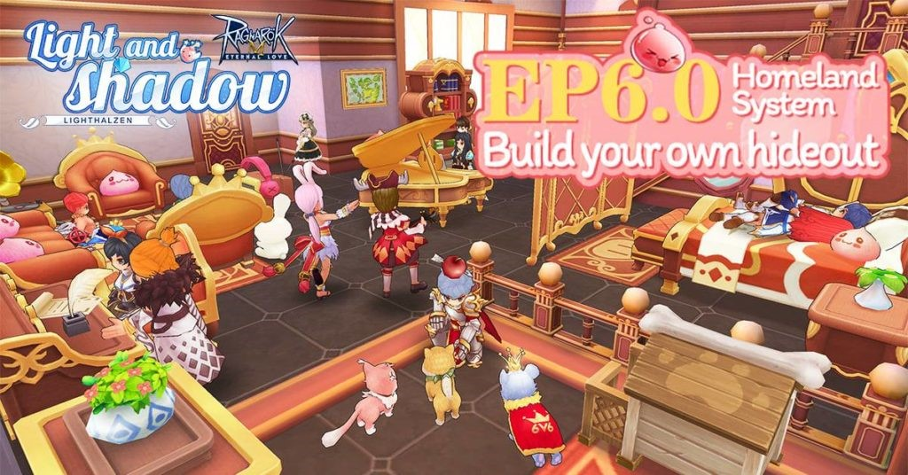
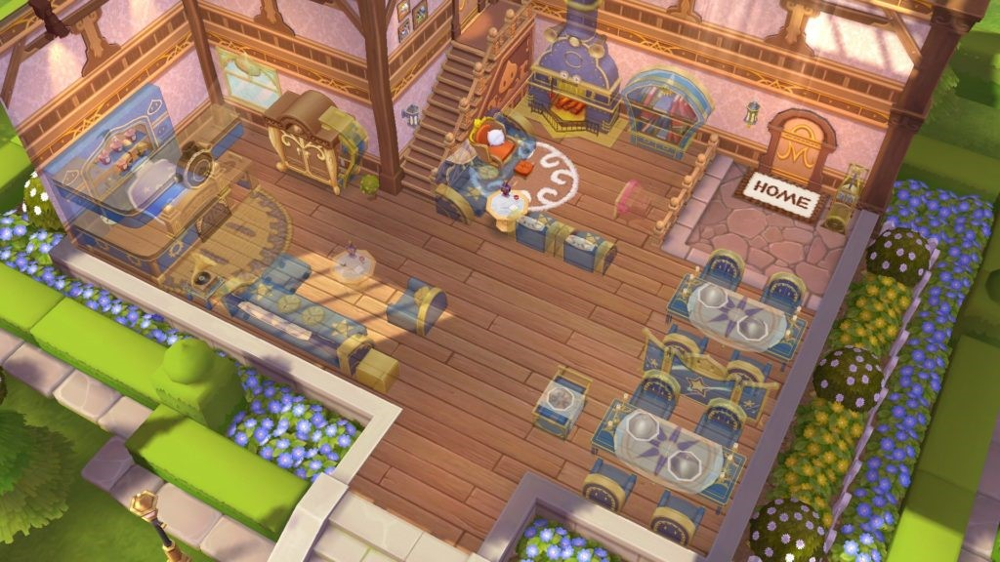
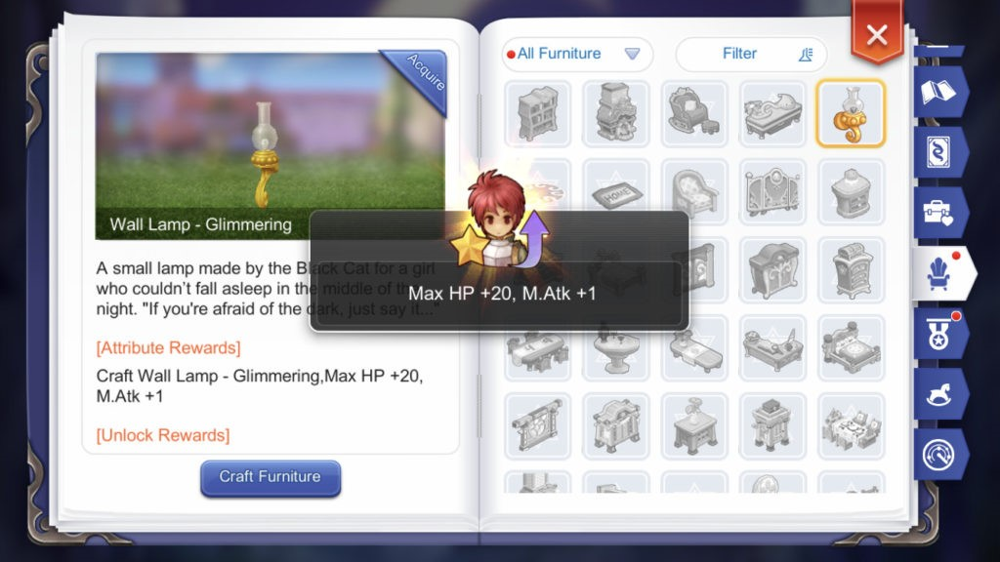
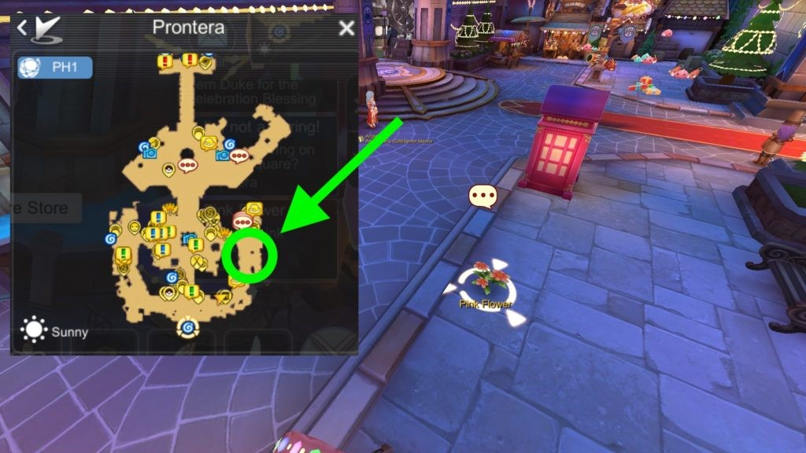
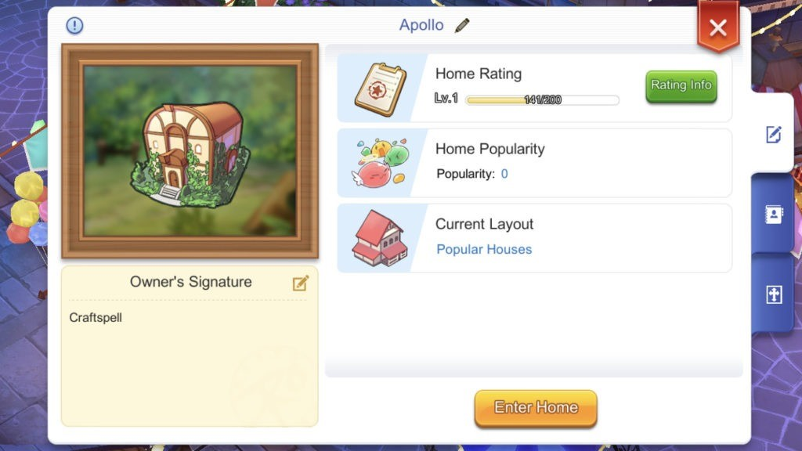
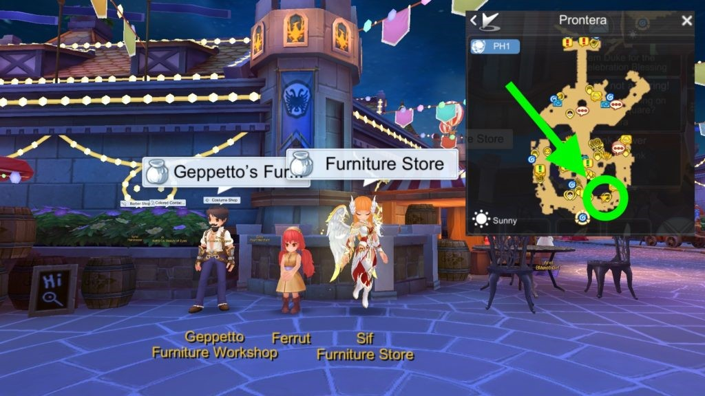
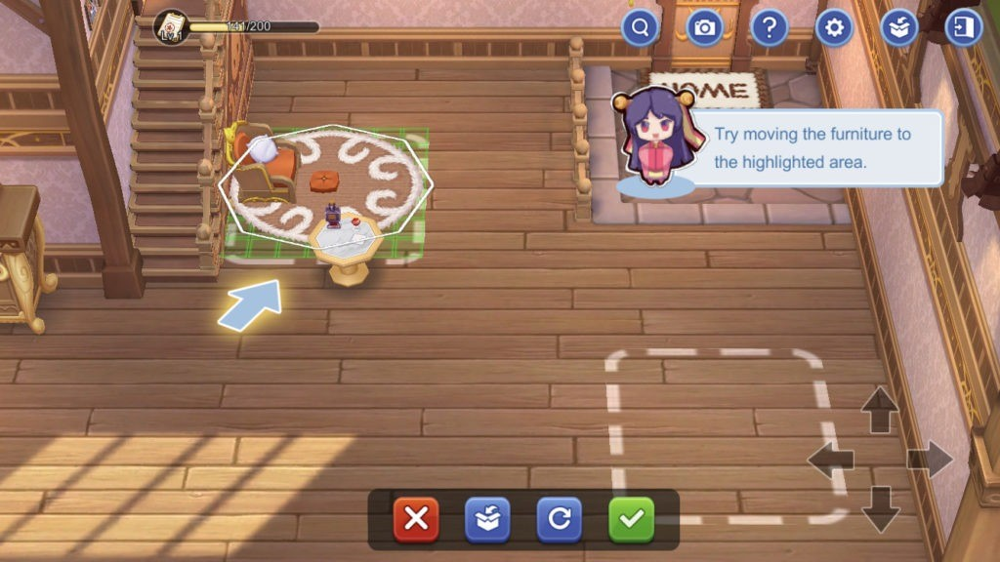
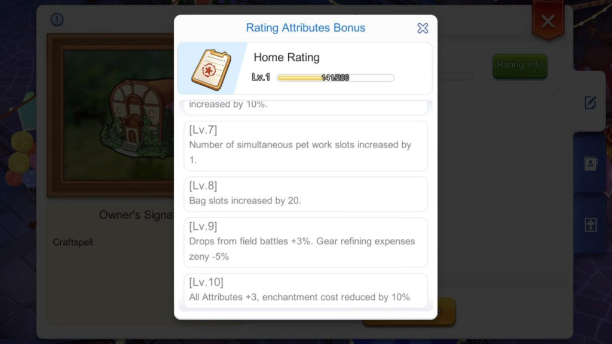
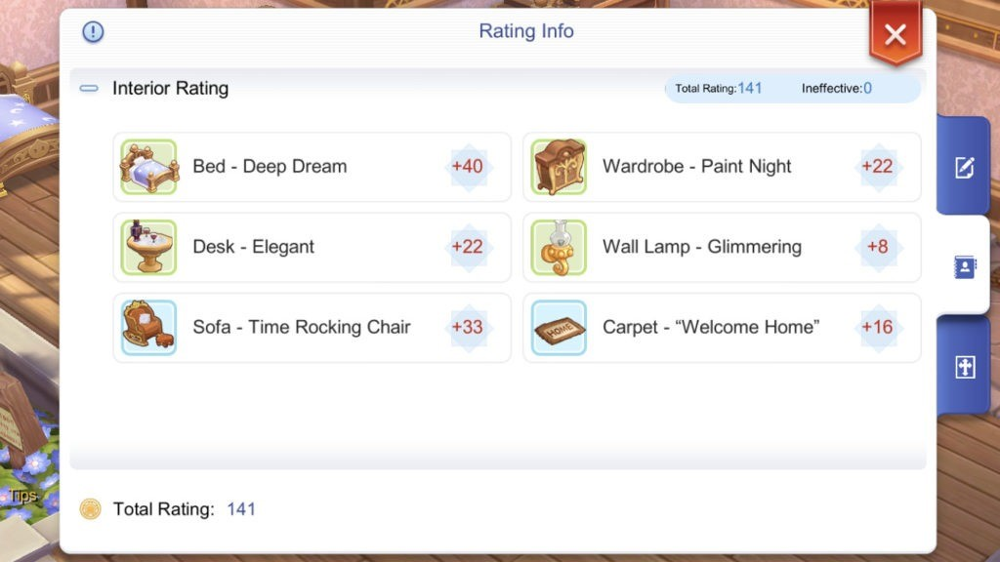
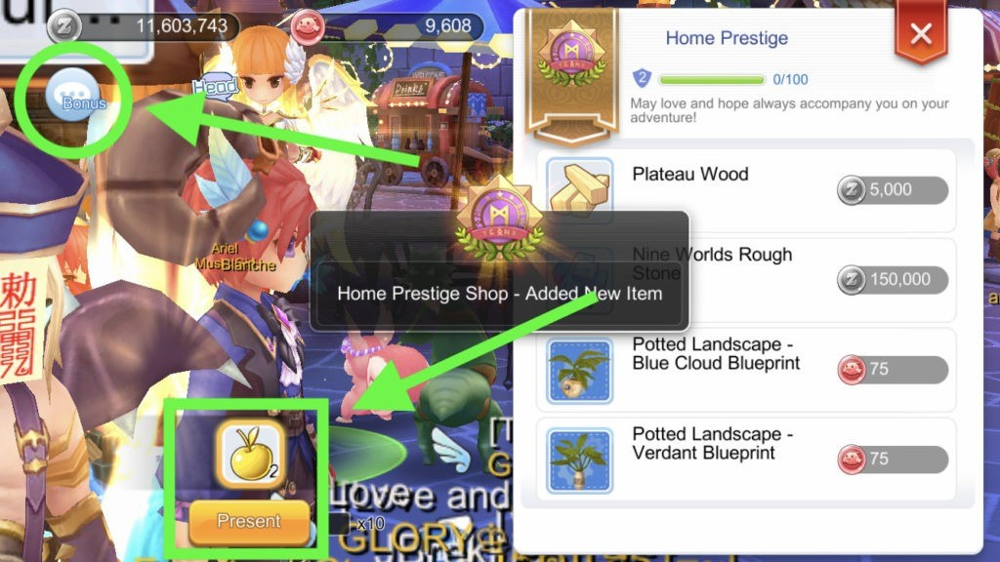

<a target="_blank" href="https://discord.gg/CK8mFcH">Лисий дискорд: https://discord.gg/CK8mFcH</a>
<h1 id="домовладение">Домовладение</h1>

Кардинально новая система, которая появится в игре после шестого эпизода – система домовладения

Система домовладения позволяет игрокам строить и обустраивать свои собственные дома, в которые в дальнейшем вы можете приглашать своих друзей.

<h2 id="преимущества-системы-домовладения">Преимущества системы домовладения</h2>

Домовладение нужно не только для того, чтобы красоваться своим жилищем перед друзьями. Дома дают множество разных бонусов их обладателям.

<h3 id="постоянная-прибавка-к-характеристикам">Постоянная прибавка к характеристикам</h3>

Основная причина развития своего жилища – постоянная прибавка к вашим статам.

Есть три пути получения этих постоянных прибавок:

<ul>
<li>

<strong>Создавать мебель</strong>.  При создании новых предметов мебели по аналогии с предметами одежды вы будете разблокировать соответствующие предметы в своей Книге Путешествий.

</li>
<li>

<strong>Повышать уровень своего дома.</strong>  Вы будете получать постоянные баффы только за счёт увеличения уровня своего дома.

</li>
<li>

<strong>Разблокировать чертежи.</strong>  Если следовать определённым чертежам, открывающимся с новой системой, вы можете разблокировать ещё больше прибавок к характеристикам.

</li>
</ul>
<h3 id="уникальная-мебель">Уникальная мебель</h3>

Помимо бонусных статов, мебель предоставляет прочие уникальные возможности:

<ul>
<li>

<strong>Дом питомца</strong>  — позволят вам держать там вашего питомца, чтобы он получал привязанность (питомец получает привязанность, когда вы его можете даже не активировать)

</li>
<li>

<strong>Sail with the Wind</strong>  — бафф, который увеличивает на 5% урон по водным мобам на 5 часов

</li>
<li>

<strong>Карта приключений</strong>  — позволяет вам телепортироваться на любую карту.

</li>
</ul>
<h2 id="покупка-дома">Покупка дома</h2>

Чтобы разблокировать систему домовладения, вам необходимо закончить специальный квест. Ваш базовый уровень должен быть не менее 70.

Поговорите с НПЦ Pink Flower  в Пронтере, чтобы начать квест.

После этого появится другой НПЦ – Ferrut. По завершению квеста вы получите Furniture Storage Box и Furniture Gallery.

Чтобы купить дом, поговорите с этим же НПЦ.

Для покупки дома вам понадобится 1,000,000 Зени. Если у вас есть Reward  Vouchers, то вы можете снизить стоимость дома на 100,000 зени за каждый.

После того, как вы купили дом, у вас разблокируется:

<ul>
<li>Blueprint Manual</li>
<li>Home Property Certificate</li>
<li>Home Prestige</li>
</ul>

Чтобы попасть в свой дом Выберете пункт меню Ещё, там будет пункт «Дом». В появившемся окне выберете «Посетить дом»<strong>.</strong>

<h2 id="создание-мебели">Создание мебели</h2>

Получить мебель, как и предметы экипировки, можно путём её создания из имеющегося чертежа и некоторого количества материалов.

Чертежи и некоторые материалы можно купить у НПЦ Geppetto  и Sif  в правой нижней части Пронтеры.

Обратите внимание, что у покупка материалов ограничена:

<table>
<thead>
<tr>
<th>Название материала</th>
<th>Цена</th>
<th>Лимит</th>
</tr>
</thead>
<tbody>
<tr>
<td>Plateau Wood</td>
<td>5,000 зени</td>
<td>200</td>
</tr>
<tr>
<td>Nine World Rough Stone</td>
<td>150,000 зени</td>
<td>10</td>
</tr>
</tbody>
</table>
Есть несколько путей, как начать создание мебели:

<ul>
<li>Открыть  чертёж  в  инвентаре</li>
<li>Выбрать мебель в режиме строительства</li>
<li>С помощью “Быстрого создания” из Blueprint  Manual</li>
</ul>

Эти действия откроют для вас окно крафта, где вы сможете быстро купить недостающие материалы

<h2 id="декорирование-дома">Декорирование дома</h2>

Чтобы начать декорирование, войдите в свой жилище, поговорите с НПЦ <strong>Delilah</strong>  <strong>и нажмёте</strong> “Начать строительство”.

При первом разговоре она научит вас базовым функциям в режиме строительства.

В режиме строительства вы можете покупать и строить новые предметы интерьера, можете перемещать их и вращать.

<h2 id="повышение-уровня-дома">Повышение уровня дома</h2>

Ваш дом может быть с 1 по 10 уровень, а показатель «рейтинг дома» означает текущий опыт, «полученный» домом. Полное заполнение этой шкалы означает повышение уровня вашего жилища.

Повышение  уровня  дома  даёт  очень  существенные  постоянные  баффы:

<table>
<thead>
<tr>
<th>Уровень</th>
<th>Бонусы</th>
</tr>
</thead>
<tbody>
<tr>
<td>1</td>
<td>Скорость восстановления ХП увеличена на 5%</td>
</tr>
<tr>
<td>2</td>
<td>Скорость восстановления СП увеличена на 5%</td>
</tr>
<tr>
<td>3</td>
<td>Базовый опыт, получаемый при каче, увеличен на 5%</td>
</tr>
<tr>
<td>4</td>
<td>Джоб, получаемый при каче, увеличен на 5%</td>
</tr>
<tr>
<td>5</td>
<td>Опыт, получаемый вашими питомцами в дом увеличен на 10%</td>
</tr>
<tr>
<td>6</td>
<td>Привязанность, получаемая вашими питомцами в доме, увеличена на 10%</td>
</tr>
<tr>
<td>7</td>
<td>Количество  мест  для  работы  питомца  увеличено  на 1</td>
</tr>
<tr>
<td>8</td>
<td>Количество слотов в сумке увеличено на 20</td>
</tr>
<tr>
<td>9</td>
<td>Дроп увеличен на 3%. Стоимость зени на заточку снижена на 5%</td>
</tr>
<tr>
<td>10</td>
<td>Все характеристики +3. Стоимость зачарования снижена на 10%</td>
</tr>
<tr>
<td></td>
<td></td>
</tr>
</tbody>
</table>
Создание мебели и установка её в дом способствуют быстрой прокачкке вашего дома.

Чем больше предметов интерьера вы поместите в свой дом, тем больше опыта получит дом, однако разные предметы мебели дают разную сумму опыта дому.

Основная идея – поставить как можно больше дешёвой мебели, которая даёт много очков опыта.

Обратите внимание, что предмет интерьера должен быть размещён в доме, чтобы дать дому опыт. Если мебель будет удалена из дома, то дом тоже потеряет опыт, который дала убранная вещь.

<h2 id="престиж-дома">Престиж дома</h2>

Когда вы говорите с НПЦ, продающим материалы для дома, сверху вы можете увидеть шкалу престижа дома. Увеличение уровня престижа увеличивает количество чертежей, которые можно купить.

Увеличить уровень престижа можно следующим способом:

<ul>
<li>Создать несколько предметов интерьера, получив с них золотые яблоки</li>
<li>Поговорите с НПЦ Sif  и нажмите кнопку “Бонус” в левом верхнем углу.</li>
<li>Отдаёте золотое яблоко НПЦ Sif.</li>
</ul>

Продолжайте давать ему яблоки до тех пор, пока вы не разблокируете все постройки, интересующие вас.

<h2 id="полезные-советы">Полезные советы</h2>
<h3 id="создавайте-как-можно-больше-мебели">Создавайте как можно больше мебели</h3>

Во-первых, создавая мебель, вы получаете золотые яблоки, которые используются для повышения престижа вашего дома. Во-вторых, создание и размещение большого количества мебели будет способствовать быстрой прокачки уровня вашего дома до 10.

<h3 id="создавайте-важную-мебель-как-можно-быстрее">Создавайте важную мебель как можно быстрее</h3>

Как только вы набиратете достаточное количество престижа, покупайте уникальную мебель. Список  такой  мебели  представлен  ниже.

<h4 id="cute-claw’s-nest-дом-питомца">1. Cute Claw’s Nest (Дом питомца)</h4>

Дом питомца – один из самый полезных предметов интерьера, который только можно создать. Он позволяет вам содержать в нём ваших питомцев, чтобы они качались и повышали их привязанность.

Данный дом не только позволит вам сэкономить время на прокачку питомца, но и вы можете осуществить слияние питомцев скорее.

Для создания Дома питомца вам нужно иметь уровень престижа дома, равный 7.

<h4 id="fireplace-flower-fire">2. Fireplace Flower Fire</h4>

Печка позволяет вам собирать Уголь, Огненный Кристалл и Лавовый Камень.

<h4 id="hayward’s-worktop">3. Hayward’s Worktop</h4>

Данная постройка позволяет вам точить и зачаровывать вещи по сниженным ценам!

Для постройки этого предмета инвентаря нужен всего лишь второй уровень престижа дома.

<h4 id="sail-with-the-wind">4. Sail with the Wind</h4>

Данная постройка даёт вам пятичасовой бафф, который повышает ваш дамаг по водным мобам на 5%.

Для строительства данного объекта уровень престижа дома должен быть не меньше 9.

<h3 id="в-первую-очередь-разблокируйте-мебель-дающую-прибавку-к-атк-и-матк">В первую очередь разблокируйте мебель, дающую прибавку к АТК и МАТК</h3>

Очевидно, что если ваш класс сконцентрирован на нанесение большого урона, то вам нужно сделать эту мебель первым делом.

<h2 id="популярность-дома">Популярность дома</h2>

Помимо просто уровня и уровня престижа дома у вашего жилища есть ещё и уровень популярности.

Когда другие персонажи посещают ваш дом, его популярность увеличивается. Чтобы посетить дом другого персонажа, нажмите на аватар игрока и выберете «Посетить дом».

В настоящее время показатель уровня популярности дома не даёт никаких видимых преимуществ.

<h2 id="расширение-дома">Расширение дома</h2>

Есть вероятность, что в этом патче сразу введут возможность построить в доме второй этаж. Если же нет – данный пункт будет полезен для следующих патчей.

Предметы, необходимые для надстройки второго этажа:

<ul>
<li>1,000,000 зени</li>
<li>15 Nine World Rough Stone</li>
<li>200 Plateau Wood</li>
</ul>

