

Материалы составлены гильдией "Лисы". Наш дискорд: <a target="_blank" href="https://discord.gg/CK8mFcH"> https://discord.gg/CK8mFcH</a>

<h1 id="новые-питомцы">Новые питомцы</h1>
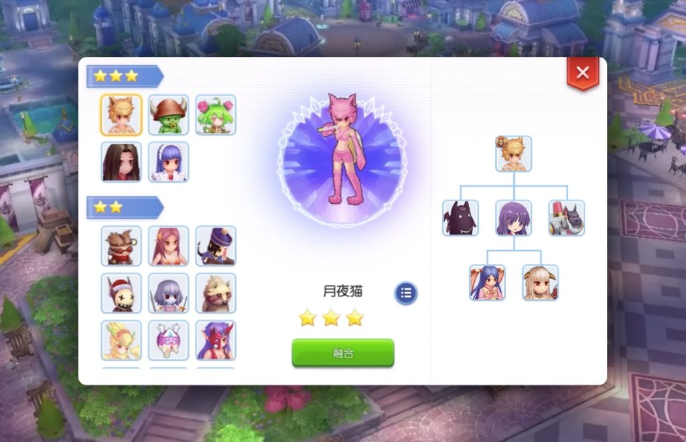

Шестой эпизод, вводит в игру десять новых питомцев, среди которых есть даже 1 МВП!

Данный гайд содержит исчерпывающее описание питомцев и шансов их поимки.

Среди питомцев есть 3 питомца с одной звездой, поимка которых возможна с помощью определённых предметов, 4 питомца с двумя звёздами, которые получаются через довольно лёгкое слияние питомцев, и 3 питомца с тремя звёздами, которых можно получить только через достаточно тяжёлое слияние. Помните, чтобы осуществить слияние питомцев, они должны достичь 10 уровня привязанности!

Многим игрокам с последнего ивента выпадают красные свечки для приручения Несправедливости, однако в других гайдах написано, что данный питомец появляется в эпизоде 6.5. Поэтому пока что он в гайд вставлен не будет.

<h2 id="приручённые-питомцы">Приручённые питомцы</h2>

Данных питомцев можно приручить, скормив им соответствующие наживки.

<table>
<thead>
<tr>
<th>Питомец</th>
<th>Наживка</th>
<th>Кол-во для 100% шанса</th>
<th>Место</th>
<th>Умения</th>
</tr>
</thead>
<tbody>
<tr>
<td>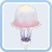Марина</td>
<td>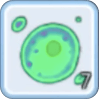Unicellular</td>
<td>3</td>
<td>Подземная пещера</td>
<td>Атакует противника Водой (400% МАТК)   Снижает получаемый водный урон питомца и его хозяина на 5%  Повышает Физическую защиту питомцем и его хозяином на 40  Увеличивает количество нормальных и качественных материалов, получаемых из приключений на 6  Повышает эффективность работы в Cuisine  Association  на 10%</td>
</tr>
<tr>
<td>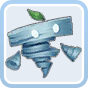Бриз</td>
<td>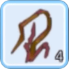Withered Leaf</td>
<td>5</td>
<td>Поле Лайтхайзена</td>
<td>Атакует противника ветром (500% АТК) с 30% шансом снизить скорость противника на 3 секунды  Снижает получаемый ветреный урон питомца и его хозяина на 5%  Увеличивает Уворот питомца и его хозяина на 10  Увеличивает шанс получения редкого сундука из приключений на 10%  Повышает эффективность работы в Cooking  Center  на 30%</td>
</tr>
<tr>
<td>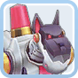Механическая гончая</td>
<td>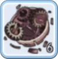Damaged Parts</td>
<td>5</td>
<td>2 этаж Биологической лаборатории</td>
<td>Атакует противника магией (550% МАТК) с 30% шансом наложить Кровотечение на противника на 3 секунды  Увеличивает МАТК питомца и его хозяина на 60, однако снижает максимальное ХП на 5%  Снижает затраты СП питомца и его хозяина на 5%  Увеличивает количество получаемых нормальных материалов в приключениях питомцев на 11  Повышает эффективность работы в Item  Shop  на 30%</td>
</tr>
</tbody>
</table><h2 id="слияние-питомцев">Слияние питомцев</h2>

Чтобы получить двух- и трёхзвёздочных питомцев, вам нужно воспользоваться слиянием питомцев.

<table>
<thead>
<tr>
<th>Питомец</th>
<th>Слияние</th>
<th>Умения</th>
</tr>
</thead>
<tbody>
<tr>
<td>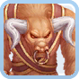Минорус</td>
<td>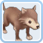 Детёныш пустынного волка  Изис  Марина</td>
<td>Атакует противника и окружающих врагов землёй (550% АТК)  Увеличивает физическую атаку питомца и его хозяина на 40  Повышает урон питомца и его хозяина по Брутам на 3%  Снижает потребляемое в приключениях время на 10%  Повышает эффективность работы в Guild  на 40%</td>
</tr>
<tr>
<td>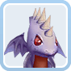Небесный дракончик</td>
<td>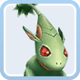 Земляной дракончик  Докеби 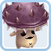 Ядовитая спора</td>
<td>Атакует противника и окружающих врагов огнём (600% АТК) с 30% шансом наложить Горение на 5 секунд  Увеличивает Максимальное ХП питомца и его хозяина на 1,000  Увеличивает урон питомца и его хозяина по драконам на 5%  Снижает стамину и время, используемые в приключениях на 10%  Повышает эффективность работы в Item  Shop  на 10%</td>
</tr>
<tr>
<td>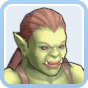Орк Леди</td>
<td> Орк Воин 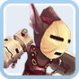 Гоблин (Щит)</td>
<td>Атакует противника магией (550% МАТК), игнорирующей МДеф с 20% шансом наложить Страх на 5 секунд  Увеличивает защиту от крита у питомца и его хозяина на 10  Увеличивает сопротивляемость питомца и его хозяина к ловушкам и заморозке на 10%  Увеличивает количество наормальных материалов, получаемых в приключениях на 11, а качественных материалов – на 6  Повышает эффективность работы в Arena  на 5%</td>
</tr>
<tr>
<td>Мартин Мусорщик</td>
<td>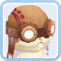 Мартин  Механическая гончая</td>
<td>Атакует противника (900% АТК) и притягивает его  Снижает получаемый магический урон питомцем и его хозяином на 5%  Увеличивает INT питомца и его хозяина 10  Повышает шанс получения редких сундуков в приключениях на 15%  Повышает эффективность работы в Pet  Association  на 30%</td>
</tr>
<tr>
<td>Горный паразит</td>
<td> Мишка Тедди  Бонган</td>
<td>Использует умение [Rose  Whip], которое наносит магический урон (600% МАТК) с 20% шансом наложить безмолвие и обездвижить противника на 3 секунды  Увеличивает шанс наложить безмолвие умением [Rose  Whip] на 30%  Снижает получаемый магический урон питомцем и его хозяином на 5%  Повышает  шанс  получения  карт  в  приключениях  на 10%  Повышает эффективность работы в Kafra  Corp  на 40%</td>
</tr>
<tr>
<td>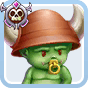Орк Детёныш</td>
<td> Орк Воин  Орк Леди</td>
<td>Использует умение [Roaring], которое провоцирует мобов в радиусе 3 метров, снижая физический и магический урон, получаемый хозяином, на 10% на 5 секунд  Снижает получаемый хозяином урон после применения умения [Roaring] ещё на 10%  Увеличивает максимальное ХП питомца и его хозяина на 5%  Увеличивает количество джоба, получаемого в приключениях на 10%  Повышает эффективность работы в Guild  на 40%</td>
</tr>
<tr>
<td>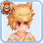Лунный цветок</td>
<td> Девиручи  Злая Нимфа  Механическая гончая</td>
<td>Использует умение [Death  Cyclone], которое наносит урон тёмным элементом (900% МАТК) с 30% шансом наложить слепоту и слабость (снижение физического и магического урона на 20%) на 10 секунд  Увеличивает  шанс  наложение [Death Cyclone] дополнительного  эффекта  на 50%  Увеличивает Физичкское и Магическое проникновение питомца и его хозяина на 2%  Повышает шанс получения карт в приключении на 15%  Повышает эффективность работы в Kafra  Corp  на 40%</td>
</tr>
</tbody>
</table>
