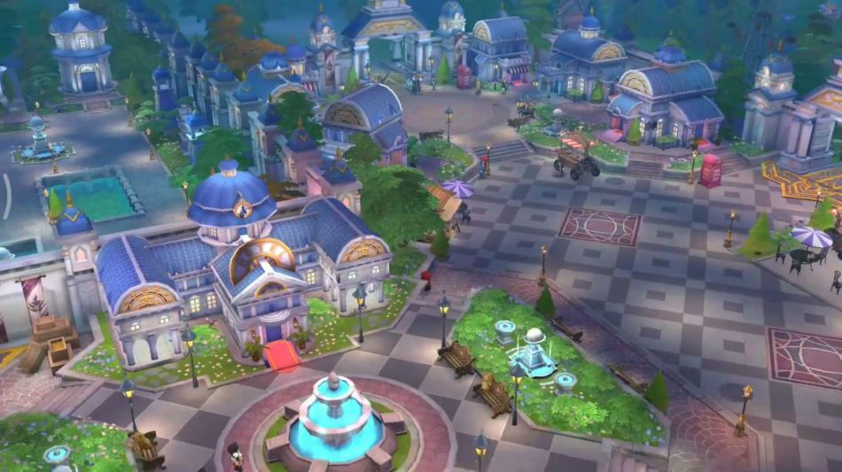
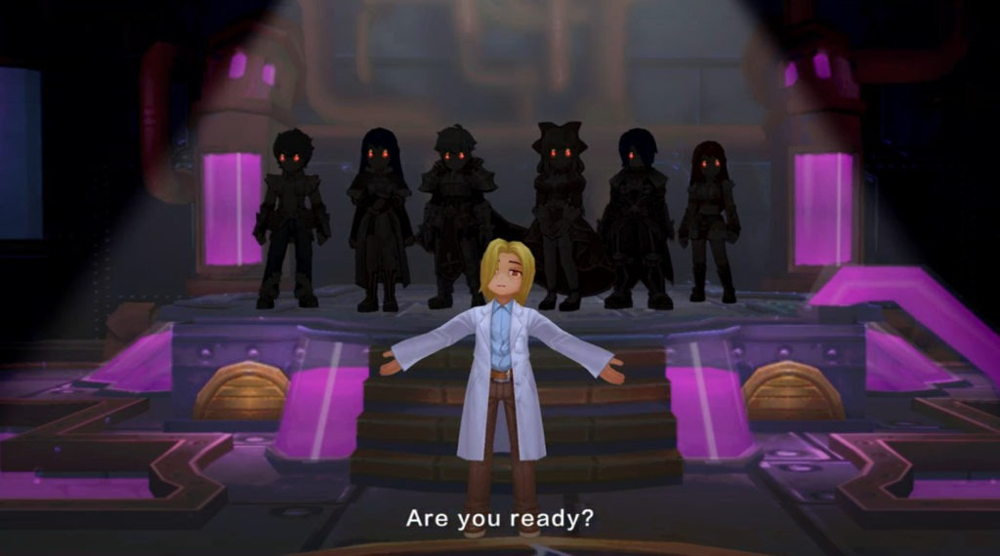
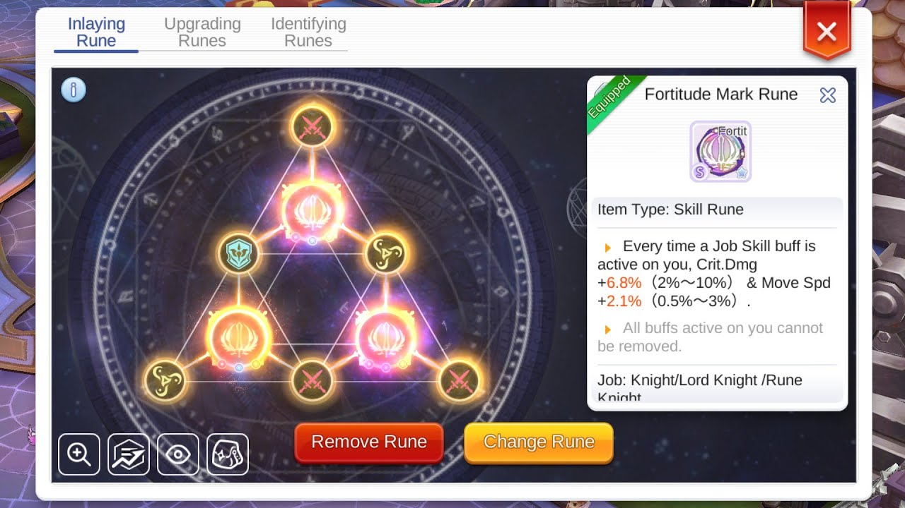
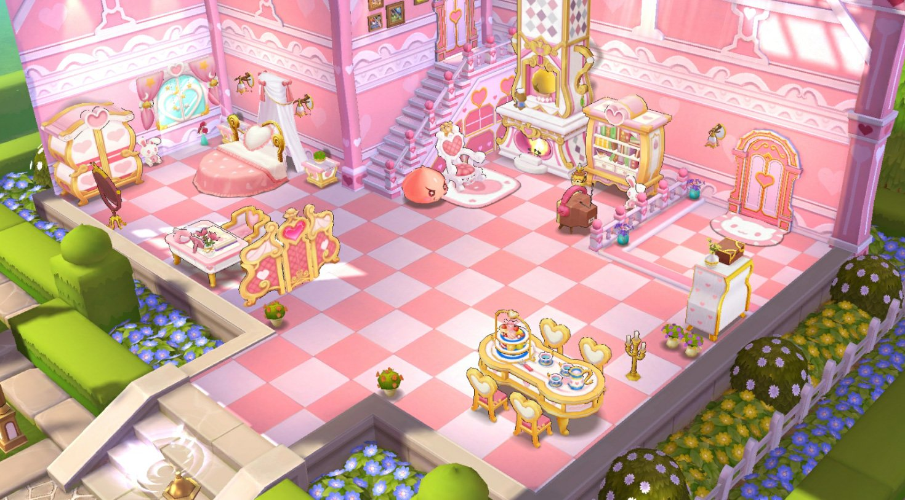
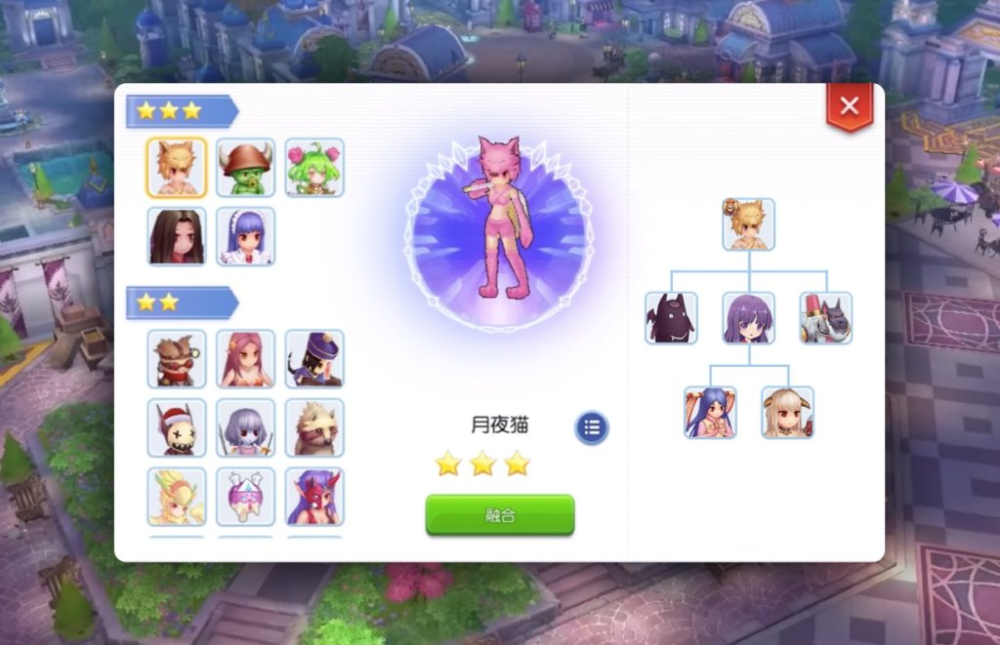
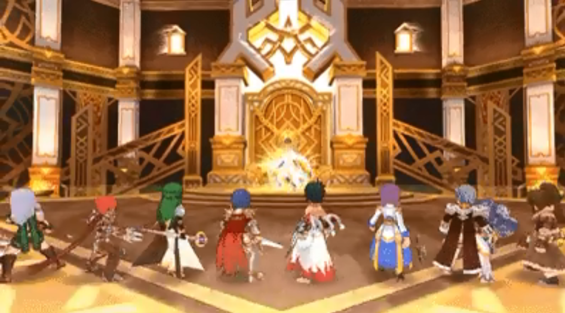

<h1 id="эпизод-6.0">Эпизод 6.0</h1>

Скоро в игру будет введён 6 эпизод. 
В связи с этим <strong>Лисы</strong> публикуют существенные игровые моменты, которые вскоре появятся на просторах Мидгарда.

Более подробно о нововведениях можно узнать в нашем дискорде: https://discord.gg/CK8mFcH

<h2 id="новые-локации">Новые локации</h2>

В 6 эпизоде игрокам становится доступен славный город Лайтхайзен, его окрестности и, разумеется, таинственная Биологическая лаборатория, располагающаяся под самим городом.

Окрестности Лайтхайзена заселены спокойными дружелюбными мобами, в то время как подземелья Лаборатории содержат в себе множество опасностей.

В этом подземелье обитают призраки жертв экспериментов, проводимых сотрудниками лаборатории.

Подробное описание карт местности и мобов, обитающих там, можно найти здесь.

<h2 id="новый-класс">Новый класс</h2>

Наконец, в игру вводятся Супер Новички! Данный универсальный класс может учить многие умения первых и вторых профессий всех классов.

Стать Супер Новичком можно после достижения 80-го базового уровня, оставаясь всё это время простым Новичком.

Подробнее описание умения Супер Новичка можно найти здесь.

<h2 id="новая-система-рун">Новая система рун</h2>

В этой новой системе вы будете собирать Руны Умений и Руны Характеристик, которые будут существенным образом влиять, как ни странно, на ваши умения и характеристики.

Не переживайте, новые руны работают вместе с уже существующими в Aesir Monument.

Руны имеют разную уникальность и эффекты. Некоторые раны даже открывают новые умения для разных профессий. Руны можно сливать друг с другом, улучшать, обменивать на случайные другие руны.

После получения, руны активируются через специальный предмет, получаемый по ходу игры.

Подробное описание новой системы рун можно найти здесь.

<h2 id="дома">Дома</h2>

Ну что, господа дизайнеры, готовы строить свой собственный дом?
 

Надеюсь, что вы готовы обрести свой собственный спокойный уголок в этом непростом игровом мире.

В игре появляется возможность покупки и декорирования своего собственного дома, в который в дальнейшем можно будет приглашать своих друзей.

Для чего нужно вкладываться в развитие собственного дома? Во-первых, вы будете разблокировать мебель в вашей книге приключений, которая будет давать постоянные баффы. Во-вторых, повышение уровня дома также даёт постоянные баффы (например, снижение стоимости заточки или усиления). В-третьих, вы можете получать ещё больше баффов от своего дома, если будете следовать определённым шаблонам.

Подробное описание новой системы домовладения можно найти здесь.

<h2 id="новые-питомцы">Новые питомцы</h2>

В новом эпизоде появляются 3 новых питомца для поимки и 7 новых питомцев, получаемых через слияние.

В их число входят один Мини босс (Детёныш Орка) и один МВП (Мунлайт).

Подробное описание новых питомцев можно найти здесь.

<h2 id="башня-танатоса">Башня Танатоса</h2>

Новый эпизод нас радует новым подземельем, который проходится двумя патьками, объединёнными в Альянс (12 человек).

После прохождения этого подземелья вы будете получать руны ранка S.

Подробное описание Башни Танатоса можно найти здесь.

<h2 id="синтез-брони">Синтез брони</h2>

В 5 эпизоде вы синтезировали своё оружие и думаете, что же сделать дальше? Новый эпизод придумал вам следующее занятие – синтез брони.

Система синтеза брони схожа с системой синтеза оружия.

Подробное описание брони и предметов, требуемых для синтеза, приведено здесь

<h2 id="прочие-изменения">Прочие изменения</h2>
<ul>
<li>Максимальный базовый уровень увеличен до 130;</li>
<li>Максимальный профессиональный уровень для третьей профессии увеличен до 70.</li>
</ul>
