<h1 id="новая-система-рун">Новая система рун</h1>
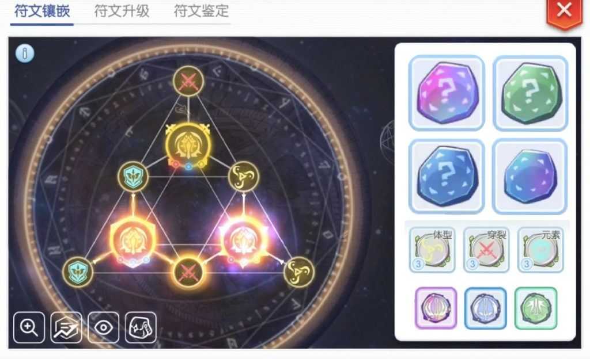

Эпизод 6.0 вводит новую систему рун, которая работает параллельно  с рунами в Aesir Monument.

Чтобы начать пользоваться рунами, необходимо завершить квест и получить <strong>Rune Box</strong>.

Поговорите с НПЦ <strong>Thomasville Ecclesia Archbishop</strong>  около <strong>Церкви Пронтеры</strong>, чтобы начать квест <strong>Сила Рун</strong>.

Игрок должен быть минимум 80 базового уровня.

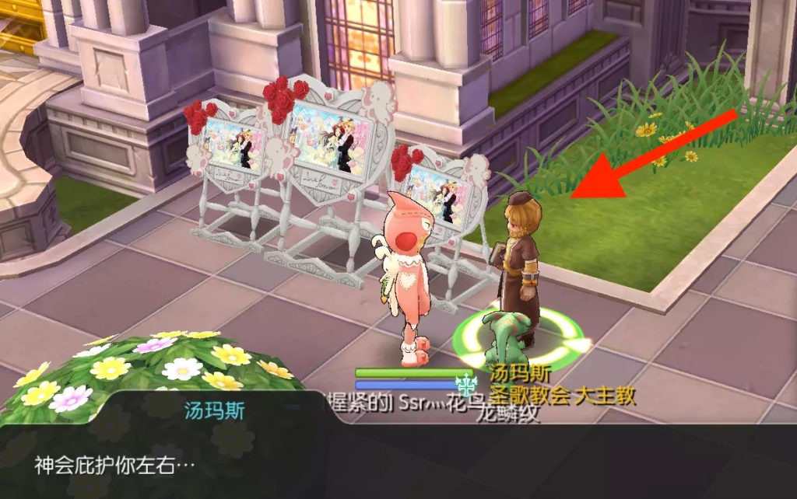

По завершению квеста вы получите  <strong>Rune Box</strong>. Этот предмет позволит вам просматривать и управлять всеми вашими рунами.

Всего существует два типа рун: Руны Умений (большие) и Руны Характеристик (малые).

<h2 id="руны-умений">Руны Умений</h2>

Руны Умений усовершенствуют силу ваших умений. Например, Рунный Рыцарь может увеличить силу умения Dragon  Breath.

Всего есть три класса рун:

Класс B  (Зелёные) 
Класс A  (Голубые) 
Класс S (Фиолетовые)

Руны класса S – самые  сильные.

Вам хотелось, чтобы в игре появилось больше рандома? Вы хотели, чтобы появилась система, похожая на систему четвёртого чанта на вещах? Тогда ваши мечты сбылись! Если вам повезёт, то вы можете получить на своей руне редкую жёлтую «звезду», которая значит, что руна сильнее, чем обычно.

Одновременно вы можете активировать три Руны Умений, однако учтите, что руны не смогут активироваться, если их просто добавить в ваш <strong>Rune Box</strong>. Чтобы активировать каждую конкретную руну, нужно иметь определённую комбинацию из Рун Характеристик.

<h2 id="руны-характеристик">Руны Характеристик</h2>

Руны Характеристик дают вам набор бонусов, увеличивающих ваши характеристики.

Деление этих рун чем-то похоже на разделение Чипов:

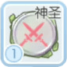Атака (Красный) 
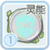Защита (Голубой) 
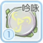Бафф (Жёлтый)

Руны  Характеристик  различаются  по  уровням (с 1 по 10).

<h3 id="руны--атаки-атк">Руны  Атаки (АТК)</h3>

 Руны Атаки окрашены в красный цвет и дают вам общее увеличение урона и разные бонусные эффекты (Игнор Дефа и бонусы для критических ударов).

Далее приведён список всех Рун Атаки и их эффектов на первом уровне руны:

<table>
<thead>
<tr>
<th>Название Руны</th>
<th>Эффект</th>
</tr>
</thead>
<tbody>
<tr>
<td>Assault ATK Rune</td>
<td>АТК +12   Заточ. АТК +4</td>
</tr>
<tr>
<td>Armor Breaking ATK Rune</td>
<td>Игнор Дефа +0.8%   Заточ. АТК +4</td>
</tr>
<tr>
<td></td>
<td></td>
</tr>
<tr>
<td>Annihilation ATK Rune</td>
<td>Увеличение урона +0.6%   Заточ. АТК +4</td>
</tr>
<tr>
<td>Penetration ATK Rune</td>
<td>Проникновение +0.4%   Заточ. АТК +4</td>
</tr>
<tr>
<td>Berserk ATK Rune</td>
<td>Критический урон +1.6%   Крит +1</td>
</tr>
<tr>
<td>Spirit ATK Rune</td>
<td>МАТК +12  Заточ. МАТК +4</td>
</tr>
<tr>
<td>Exorcism ATK Rune</td>
<td>Игнор МДефа +0.8%  Заточ. МАТК +4</td>
</tr>
<tr>
<td>Incantation ATK Rune</td>
<td>Маг. Проникновение +0.4%  Заточ. МАТК +4</td>
</tr>
<tr>
<td>Element ATK Rune</td>
<td>Урон от Ветра, Земли, Воды,   Огня и Призрачного элемента +0.6%</td>
</tr>
<tr>
<td>Illusion ATK Rune</td>
<td>Увеличение магического урона +0.6%   Заточ. МАТК +4</td>
</tr>
<tr>
<td>Poisonous Shadow ATK Rune</td>
<td>Урон ядом +0.6%   Нейтральная АТК +0.6%</td>
</tr>
<tr>
<td>Divine ATK Rune</td>
<td>Урон святостью +0.6%   Бонусное лечение +0.6</td>
</tr>
</tbody>
</table><h2 id="руны--защиты-def">Руны  Защиты (DEF)</h2>

 Руны защиты окрашены в голубой цвет и увеличивают ваши защитные характеристики и дают другие эффекты, такие как снижение урона от элементов или от критических ударов. Данные руны очень полезны для танков, так как повышают вашу выживаемость.

Далее приведён список всех Рун Защиты и их эффектов на первом уровне руны:

<table>
<thead>
<tr>
<th>Название Руны</th>
<th>Эффект</th>
</tr>
</thead>
<tbody>
<tr>
<td>HP DEF Rune</td>
<td>Макс ХП +325   Деф +3</td>
</tr>
<tr>
<td>Shield DEF Rune</td>
<td>Снижение урона от АТК +0.4%   Снижение урона от автоатаки +0.3%</td>
</tr>
<tr>
<td>Evil DEF Rune</td>
<td>Снижение урона от Яда, Тьмы, Нежити,   Святости и Нейтрала +0.6%   Деф +4   МДеф +2</td>
</tr>
<tr>
<td>Magic Crasher DEF Rune</td>
<td>Снижение урона от МАТК. +0.4%   Снижение урона от автоатаки +0.3%</td>
</tr>
<tr>
<td>Steel DEF Rune</td>
<td>Деф +0.8%   Снижение урона от умений +0.4%</td>
</tr>
<tr>
<td>Fierce DEF Rune</td>
<td>Снижение урона от критов +1.6%   Сопротивляемость критам +1   Снижение урона от автоатаки +0.3%</td>
</tr>
<tr>
<td>Melee DEF Rune</td>
<td>Снижение получаемого физического   урона от ближних атак +0.6%   Деф +0.3%</td>
</tr>
<tr>
<td>Element DEF Rune</td>
<td>Снижение урона от Ветра, Земли, Воды,    Огня и Призрачного элемента +0.6%   Деф +4   МДеф +2</td>
</tr>
<tr>
<td>Spiritual Power DEF Rune</td>
<td>Макс СП +16   МДеф +3   Деф+3</td>
</tr>
<tr>
<td>Flying Blade DEF Rune</td>
<td>Снижение получаемого физического   урона от дальних атак +0.6%   Деф +0.3%</td>
</tr>
<tr>
<td>Spell DEF Rune</td>
<td>МДеф +0.8%   Снижение урона от умений +0.4%</td>
</tr>
</tbody>
</table><h2 id="руны--баффов">Руны  Баффов</h2>

 Руны баффов окрашены в жёлтый цвет и дают вам увеличение одной из характеристик, увеличение вашего урона и снижение урона мобов по вам.

Далее приведён список всех Рун Защиты и их эффектов на первом уровне руны:

<table>
<thead>
<tr>
<th>Название Руны</th>
<th>Эффект</th>
</tr>
</thead>
<tbody>
<tr>
<td>STR Buff Rune</td>
<td>Str +1   Урон по всем расам +0.2%    Урон от всех мобов -0.2%</td>
</tr>
<tr>
<td>LUK Buff Rune</td>
<td>Luk +1    Урон по всем расам +0.2%    Урон от всех мобов -0.2%</td>
</tr>
<tr>
<td>Size Buff Rune</td>
<td>Урон по средним мобам+0.4%    Снижение урона от средних мобов +0.4%</td>
</tr>
<tr>
<td>AGI Buff Rune</td>
<td>Agi +1    Урон по всем расам +0.2%    Урон от всех мобов -0.2%</td>
</tr>
<tr>
<td>DEX Buff Rune</td>
<td>Dex +1    Урон по всем расам +0.2%    Урон от всех мобов -0.2%</td>
</tr>
<tr>
<td>INT Buff Rune</td>
<td>Int +1    Урон по всем расам +0.2%    Урон от всех мобов -0.2%</td>
</tr>
<tr>
<td>VIT Buff Rune</td>
<td>Vit +1    Урон по всем расам +0.2%    Урон от всех мобов -0.2%</td>
</tr>
<tr>
<td>Chant Buff Rune</td>
<td>Переменное время каста -1%    Переменное время каста -0.05 секунд    Затраты СП -0.5%</td>
</tr>
</tbody>
</table><h2 id="активация-рун">Активация рун</h2>

Для активации рун нужно открыть первую вкладку в вашем Rune  Box.

Здесь вы можете увидеть два типа слотов: Три больших – они для Рун Умений и 6 маленьких – они для Рун Характеристик.

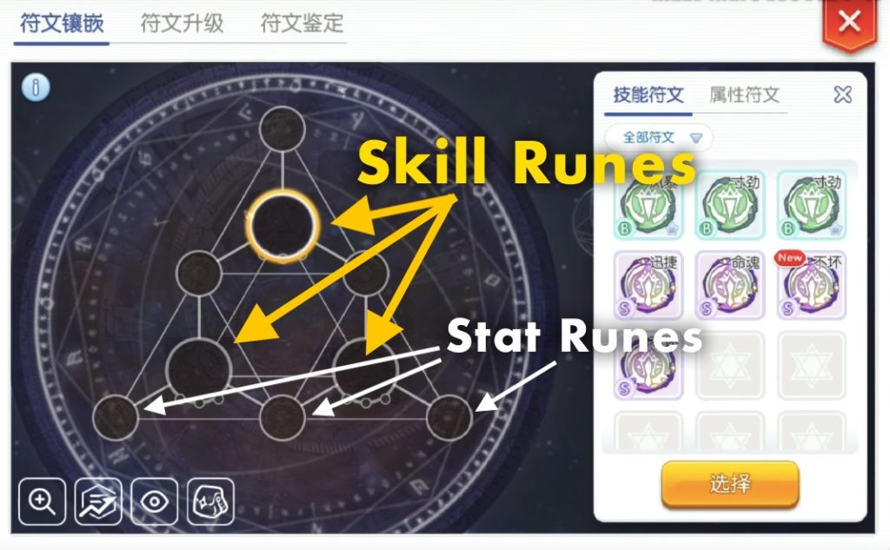

Каждой Руне Умений необходимо три определённые Руны Характеристики для активации.

В нижней части Руны Умения можно Увидеть 3 точки, которые символизируют 3 вида Рун Характеристик, которые должны находиться в связи с этой руной для её активации

Например, на картинке, приведённой снизу, Руна Умений требует 1 Руну Атаки, 1 Руну Защиты и 1 Руну Баффа. Расположить Руны Характеристик нужно вокруг Руны Умений.

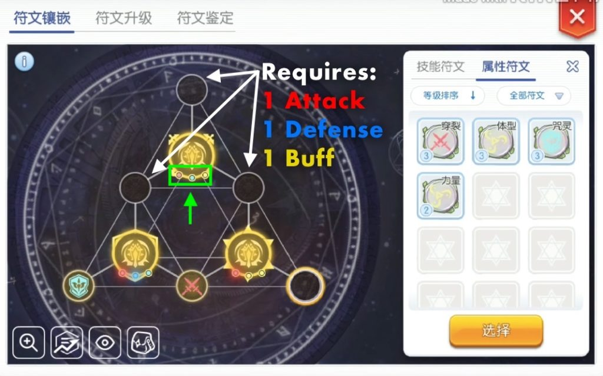

Как можно увидеть из связей Рун Характеристик с Рун Умений, три центральные Руны Характеристик одновременно используются сразу двумя близлежащими Рунами Умений.

Поэтому вам предстоит подумать над расположением ваших рун, если вы хотите получить нужные эффекты. Важно отметить, что порядок Рун Характеристик не имеет значение. Важно только, чтобы они были соединены с нужной руной.

После того, как вы верно поместили Руны Характеристик, соответствующая Руна Умений начнёт светиться разными цветами, что её активацию.

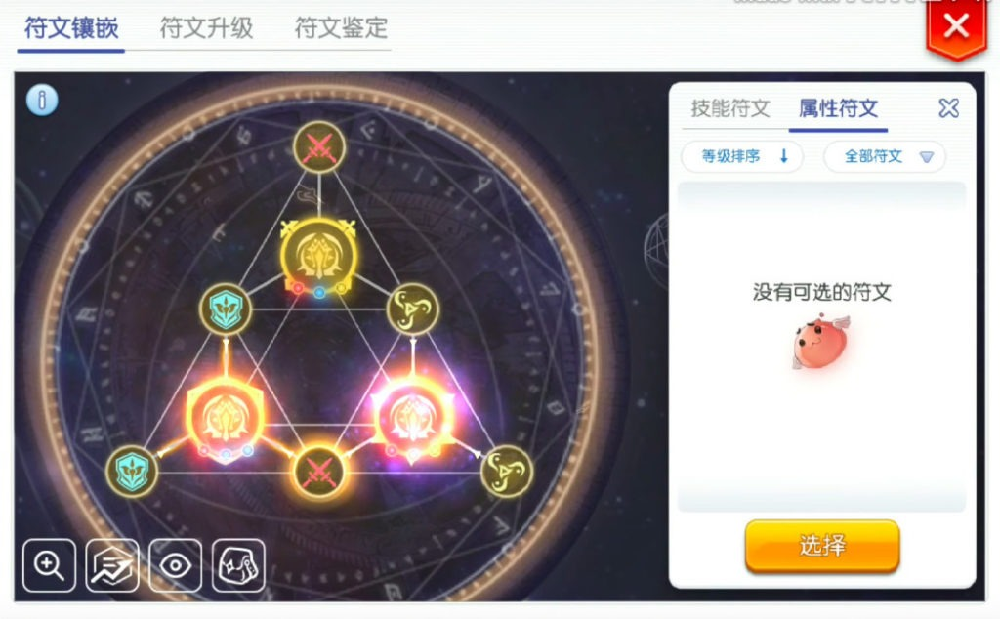
<h2 id="получение-рун">Получение рун</h2>

Оба типа рун могут быть приобретены из Рунных камней и Рунных коробок

Рунные камни и Рунные коробки можно будет купить у НПЦ в Пронтере, в Магазине BCC, а также они могут выпасть в Башне Танатоса.

У НПЦ Рунные камни и Рунные коробки можно купить за зени, светящийся материал, золотые медали и контрибуцию. Количество покупок в неделю ограничено.

Чтобы распознать Рунные камни, надо использовать увеличительное стекло, которое можно купить у НПЦ за 1,000 зени каждое.

Чтобы распознать Рунный камень, перейдите в третью вкладку в вашей Rune  Box. Вы можете распознавать руны по одному, либо в пачке по 10 штук.

После распознавания можно будет увидеть, прибавку к каким умениям и характеристикам оно будет давать.

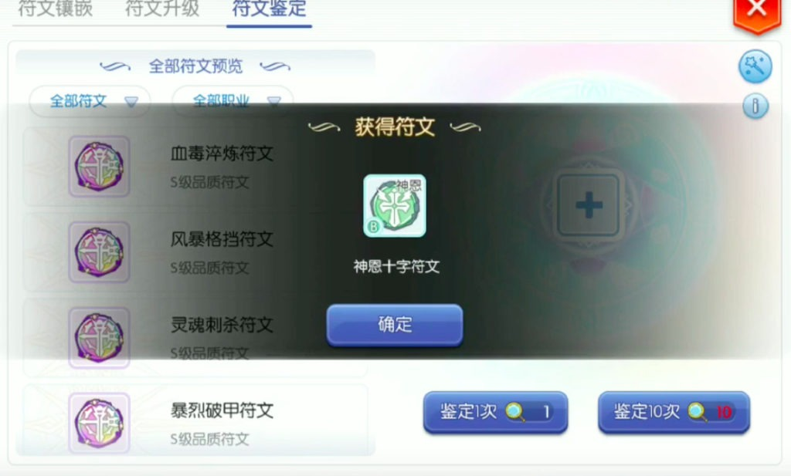

Руны Умений могут не совпадать с вашим классом, однако система рун позволяет конвертировать полученные руны в те, которые нужны вам.

<h3 id="получение-рунных-камней">Получение рунных камней</h3>

Чтобы получить Руну Умений, вам нужно получить неопознанный Рунный камень.

Всего существует три типа Рунных камней:

<table>
<thead>
<tr>
<th>Рунный камень</th>
<th>Как получить</th>
<th>Стоимость</th>
</tr>
</thead>
<tbody>
<tr>
<td> Faint Rune Stone Руна умений Класса B</td>
<td>НПЦ Аукцион Башня Танатоса</td>
<td>100,000 зени</td>
</tr>
<tr>
<td> Smooth Rune Stone Руна умений Класса A</td>
<td>НПЦ  Аукцион Башня Танатоса</td>
<td>250,000 зени</td>
</tr>
<tr>
<td>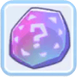 Glittering Rune Stone Руна  умений  Класса S</td>
<td>Магазин BBC</td>
<td>15 BCC</td>
</tr>
</tbody>
</table><h3 id="получение-рун-характеристик">Получение Рун Характеристик</h3>

Чтобы  получить  Руну  Характеристик, нужно  открыть  Рунную  коробку. Из этой коробке можно получить только одну случайную Руну Характеристик.

Вы можете купить это коробки у НПЦ (стоит около кузнеца в Пронтере), используя зени, золотые медали, контрибуцию и светящийся материал.

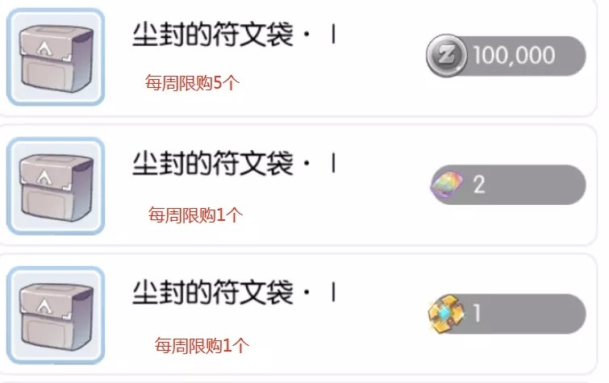

Вы можете купить Старую рунную коробку из магазина BCC, которая позволит вам выбрать необходимую вам руну.

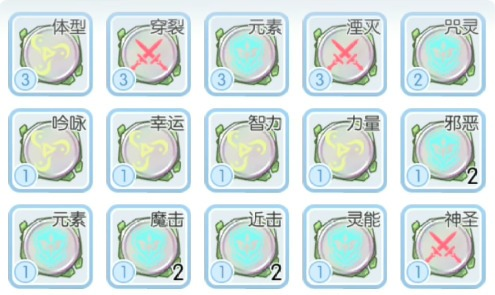

Число на голубом фоне в левом нижнем углу руны обозначает её уровень. Вы можете осуществить слияние нескольких рун одинакового типа для получения руны следующего уровня.

Покупка всех возможных Рун Характеристик и Умений потребует от вас следующих недельных трат:

<ul>
<li>

2 Миллиона зени

</li>
<li>

25 светящегося материала

</li>
<li>

4000 Контрибуции

</li>
<li>

13 Золотых медалей

</li>
</ul>
<h2 id="повышение-класса-рун-умений">Повышение класса Рун Умений</h2>

Как уже было сказано выше, руны бывают трёх классов: B, A  и S.

Чем выше класс руны, тем лучше её эффекты.

Разумеется, в идеале вам нужно стремиться к тому, чтобы все ваши руны были класса S.

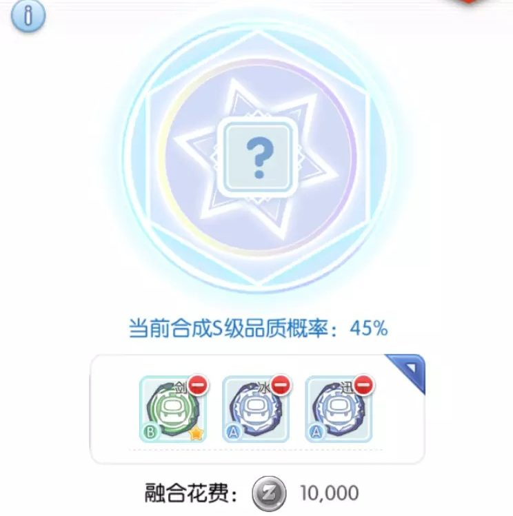

Чтобы повысить класс руны, вам нужно объединить три руны.

Объединение происходит через НПЦ, который стоит в Пронтере возле кузнеца.

Далее будет приведена таблица вероятностей получения рун от различных комбинаций.

<table>
<thead>
<tr>
<th>Комбинация</th>
<th>Результат</th>
</tr>
</thead>
<tbody>
<tr>
<td>B + B + B</td>
<td>60% Шанс получения руны класса A</td>
</tr>
<tr>
<td>B + B + A</td>
<td>20% Шанс получения руны класса S</td>
</tr>
<tr>
<td>B + A + A</td>
<td>45% Шанс получения руны класса S</td>
</tr>
<tr>
<td>B + A + S</td>
<td>80% Шанс получения руны класса S</td>
</tr>
<tr>
<td>B + S + S</td>
<td>90% Шанс получения руны класса S</td>
</tr>
<tr>
<td>A + A + A</td>
<td>70% Шанс получения руны класса S</td>
</tr>
<tr>
<td>A + A + S</td>
<td>85% Шанс получения руны класса S</td>
</tr>
<tr>
<td>A + S + S</td>
<td>95% Шанс получения руны класса S</td>
</tr>
<tr>
<td>S + S + S</td>
<td>100% Шанс получения руны класса S</td>
</tr>
</tbody>
</table><h2 id="получение-определённых-рун">Получение определённых рун</h2>

Руны умений не всегда связаны с вашей профессией, однако есть способ 100% получения нужной вам руны. Для этого используются уже пять Рун Умений. Просто поговорите НПЦ, рядом с кузнецом в Пронтере. Каждый  реролл  будет  стоить 20,000 зени.

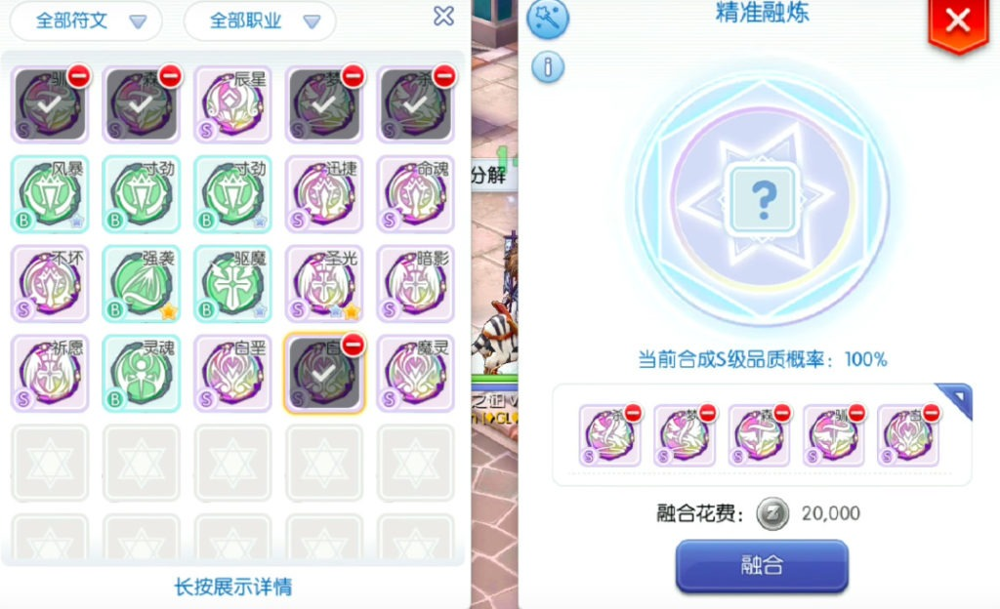

Класс получаемой руны зависит от классов используемых рун. Каждая руна даёт 20% к шансу получения руны этого класса.

Несколько примеров:

<ul>
<li>A + A + A + S + S = 60% шанс получить руну класса A  и 40% шанс получить руну класса S</li>
<li>S + S + S + S + S = 100% шанс  получить  руну  класса S</li>
</ul>
<h2 id="реролл-рун">Реролл рун</h2>

Наконец, новая система позволяет менять бонусы на Рунах Умений у того же НПЦ в Пронтере.

Вы можете сделать это, используя три одинаковые руны.

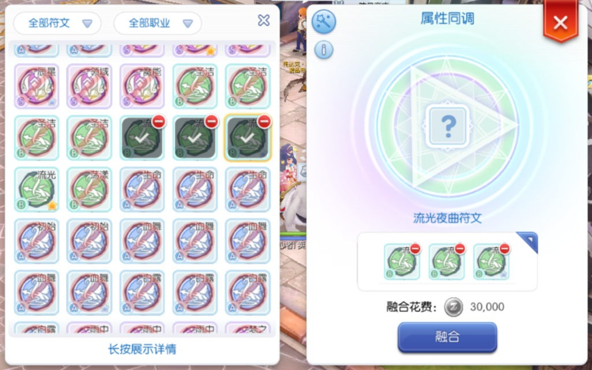
