

Материалы составлены гильдией "Лисы". Полный список гайдов и обсуждение нового эпизода в нашем дискорде: <a target="_blank" href="https://discord.gg/CK8mFcH"> https://discord.gg/CK8mFcH</a>

<h1>Синтез брони</h1>
<h2 id="img-src.synth_fintyran.png--tyrannical-armor"> Tyrannical Armor</h2>
<ul>
<li>

Деф +205

</li>
<li>

Agi +10, Крит +15

</li>
<li>

Макс ХП +4,000

</li>
<li>

Макс ХП +5%

</li>
<li>

Критический урон +10%

</li>
<li>

Деф +10%

</li>
<li>

Каждая 1 единица заточки увеличивает M.Деф на 1%.

</li>
<li>

При использовании мечей даёт Критический урон +10%. При заточке на +5 и при использовании мечей, даёт Atk +2%, Критический урон +2%. При заточке +10 и при использовании мечей, даёт Atk +3%, Критический урон +3%. При заточке +15 и при использовании мечей, даёт Atk +5%, Критический урон +5%.

</li>
<li>

Начиная с уровня заточки +8, каждая заточка на +1 увеличивает Atk  и Критический урон на 1% (до 8%).

</li>
<li>

Flamberge X + Tyrannical Armor + Advanced Sack Teddy Shoes IV + Undershirt VIII: Atk +3%, Критический урон +3%, ASPD +5%, Макс ХП +10%

</li>
<li>

Furious Soldier + Tyrannical Armor + Advanced Sack Teddy Shoes IV + Undershirt VIII: Atk +3%, Критический урон +3%, ASPD +5%, Макс ХП +10%

</li>
</ul>
<h3>Предметы для синтеза:</h3>
<ul>
<li>

 Beast Heart VIII

</li>
<li>

 Angelic Protection VIII

</li>
<li>

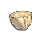 Panties II

</li>
<li>

 Glow Metal× 16

</li>
<li>

 Chaotic Metal× 8

</li>
<li>

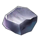 Iron Ore× 2000

</li>
<li>

 Wicked Heart× 8

</li>
<li>

 Moldy Gold Coins× 1000

</li>
<li>

 Zeny× 800 000

</li>
</ul>
<h2 id="img-src.synth_finblanking.png--blanking-coat"> Blanking Coat</h2>
<ul>
<li>

Деф +196

</li>
<li>

Int &amp; Dex +10

</li>
<li>

Макс  ХП +3,500

</li>
<li>

Макс СП +800

</li>
<li>

Игнор Деф +10%

</li>
<li>

Деф +10%

</li>
<li>

Каждая 1 единица заточки увеличивает M.Деф by 1%.

</li>
<li>

All Hunter Trap Skill SP Costs -15%

</li>
<li>

Каждая 1 единица заточки увеличивает урон от ловушек Охотника на 2%. Начиная с уровня заточки +8, каждая заточка на +1 увеличивает магический урон на 1% (до 8%).

</li>
<li>

Blanking  Coat + Luna  Brooch  VI: урон от ловушек Охотника +10%

</li>
</ul>
<h3>Предметы для синтеза:</h3>
<ul>
<li>

 Stardust Robe

</li>
<li>

 Orleans’s Gown VIII

</li>
<li>

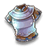 Cat’s Blessing II

</li>
<li>

 Glow Metal× 16

</li>
<li>

 Chaotic Metal× 8

</li>
<li>

 Chemical Gas Cylinder× 2000

</li>
<li>

 Warrior’s Will× 8

</li>
<li>

 Moldy Gold Coins× 1000

</li>
<li>

 Zeny× 800 000

</li>
</ul>
<h2 id="img-src.synth_finstar_shatter.png--star-shatter’s-gown"> Star Shatter’s Gown</h2>
<ul>
<li>

Деф +196

</li>
<li>

Int +12 &amp; Dex +8

</li>
<li>

M.Atk +10%

</li>
<li>

Переменное время каста -10%

</li>
<li>

Макс  ХП +3,500

</li>
<li>

M.Деф +10%

</li>
<li>

Каждая 1 единица заточки увеличиваетДеф by 1%.

</li>
<li>

При заточке на +5, увеличивает урон ветром, землёй, водой и огнём на 5%. При заточке на +10, увеличивает Игнор M.Деф на 5%. При заточке на +15, увеличивает M.Atk на 5%.

</li>
<li>

Начиная с уровня заточки +8, каждая заточка на +1 увеличивает Магическое проникновение на 1% (до 8%).

</li>
<li>

Wizardry Staff VIII (or Wizard Force) + Robe of Cast VIII (or Star Shatter’s Gown) + Eye of Dullahan VIII (or Kraken’s Eye) + Crystal Pumps IV: Переменное  время  каста -5%, Магический урон +3%, Игнор  M.Деф +3%.

</li>
</ul>
<h3>Предметы для синтеза:</h3>
<ul>
<li>

 Robe Of Cast VIII

</li>
<li>

 Silver Robe VIII

</li>
<li>

 Silk Robe II

</li>
<li>

 Glow Metal× 16

</li>
<li>

 Chaotic Metal× 8

</li>
<li>

 Iron Ore× 2000

</li>
<li>

 Warrior’s Will× 8

</li>
<li>

 Moldy Gold Coins× 1000

</li>
<li>

 Zeny× 800 000

</li>
</ul>
<h2 id="img-src.synth_finchosen_gow.png--the-chosen’s-gown"> The Chosen’s Gown</h2>
<ul>
<li>

Деф +205

</li>
<li>

Dex &amp; Int +10

</li>
<li>

Макс  ХП +4,000

</li>
<li>

Макс СП +500

</li>
<li>

Иммунитет к страху

</li>
<li>

Деф +10%

</li>
<li>

Каждая 1 единица заточки увеличивает M.Деф by 1%.

</li>
<li>

Увеличивает множитель урона в формуле Asura  Strike  (Skill  Level  x4 + Remaining  SP/100) на 2.

</li>
<li>

Увеличивает множитель Hell  Gate  на 50%. За каждый +1 к уровню заточки увеличивает множитель Hell  Gate  на 20%.

</li>
<li>

При заточке на +5, увеличивает Макс СП +5%. При заточке на +10, увеличивает Макс СП &amp; Макс ХП +5%. При заточке на +15, увеличивает Atk +5% and Damage to L-size Monsters +15%.

</li>
<li>

Начиная с уровня заточки +8, каждая заточка на +1 увеличивает Макс СП by 2% (up  to 16%).

</li>
<li>

Sura Rampage + The Chosen’s Gown + Staunch Ring IV: Увеличение  урона Hell Gate +5%.

</li>
<li>

Sky Smash + The Chosen’s Gown + Staunch Ring IV: Увеличение  урона Hell Gate +5%

</li>
</ul>
<h3>Предметы для синтеза:</h3>
<ul>
<li>

 Staunch Clothes X

</li>
<li>

 Orleans’s Gown VIII

</li>
<li>

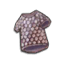 Claytos Cracking Earth Armor

</li>
<li>

 Glow Metal× 16

</li>
<li>

 Wicked Heart× 8

</li>
<li>

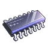 Semiconductor× 2000

</li>
<li>

 Warrior’s Will× 8

</li>
<li>

 Moldy Gold Coins× 1000

</li>
<li>

 Zeny× 800 000

</li>
</ul>
<h2 id="img-src.synth_finchosen_arm.png--the-chosen’s-armor"> The Chosen’s Armor</h2>
<ul>
<li>

Деф +243

</li>
<li>

Str &amp; Dex +12

</li>
<li>

Макс  ХП +4,000

</li>
<li>

Иммунитет к страху

</li>
<li>

Урон от умения Grand  Cross  +20%

</li>
<li>

Урон от умения Overbrand  +10%

</li>
<li>

Деф +10%

</li>
<li>

Каждая 1 единица заточки увеличивает M.Деф by 1%.

</li>
<li>

Atk &amp; M.Atk +2%. При заточке на +5, увеличивает Atk &amp; M.Atk +2%. При заточке на +10, увеличивает Atk &amp; M.Atk +3%. При заточке на +15, увеличивает Atk &amp; M.Atk +5%.

</li>
<li>

Начиная с уровня заточки +8, каждая заточка на +1 увеличивает физический и магический урон на 1% (до 8%).

</li>
</ul>
<h3>Предметы для синтеза:</h3>
<ul>
<li>

 Staunch Armor X

</li>
<li>

 Garman Plate Armor VIII

</li>
<li>

 Aebecee’s Raging Typhoon Armor

</li>
<li>

 Glow Metal× 16

</li>
<li>

 Wicked Heart× 8

</li>
<li>

 Semiconductor× 2000

</li>
<li>

 Chaotic Metal× 8

</li>
<li>

 Moldy Gold Coins× 1000

</li>
<li>

 Zeny× 800 000

</li>
</ul>
<h2 id="img-src.synth_finglorious.png--glorious-praise"> Glorious Praise</h2>
<ul>
<li>

Деф +196

</li>
<li>

Int &amp; Dex +10

</li>
<li>

Макс  ХП +4,000

</li>
<li>

M.Деф +10%

</li>
<li>

Каждая 1 единица заточки увеличивает Деф by +1%.

</li>
<li>

Затраты  СП  на Kyrie Eleison, Magnificat, и Assumptio -50%.

</li>
<li>

Макс СП +10%, Макс ХП +5%, and  Бонусное Лечение +5%. При заточке на +5, увеличивает Бонусное Лечение +5%. При заточке на +10, увеличивает Бонусное Лечение &amp; Макс ХП +5%. При заточке на +15, увеличивает Макс СП &amp; Макс ХП +5%.

</li>
<li>

Начиная с уровня заточки +8, каждая заточка на +1 снижает получаемый урон от нейтрала, ветра, земли, воды и огня на 1% (до 8%).

</li>
<li>

Croce Staff IV + Glorious Praise: Бонусное  Лечение +5%. При заточке Glorious  Praise  на +10 или выше увеличивает Бонусное Лечение на 10%.

</li>
</ul>
<h3>Предметы для синтеза:</h3>
<ul>
<li>

 Holy Robe VIII

</li>
<li>

 Silver Robe VIII

</li>
<li>

 Exorcist Robe II

</li>
<li>

 Glow Metal× 16

</li>
<li>

 Warrior’s Will× 8

</li>
<li>

 Chemical Gas Cylinder× 2000

</li>
<li>

 Wicked Heart× 8

</li>
<li>

 Moldy Gold Coins× 1000

</li>
<li>

 Zeny× 800 000

</li>
</ul>
<h2 id="img-src.synth_finperseverance.png--perseverance-armor"> Perseverance Armor</h2>
<ul>
<li>

Деф +205

</li>
<li>

Str &amp; Vit +10

</li>
<li>

Макс  ХП +4,000

</li>
<li>

Деф +10%

</li>
<li>

Каждая 1 единица заточки увеличивает M.Деф by +1%.

</li>
<li>

When equipped by melee-ranged jobs, grants Atk +160

</li>
<li>

При заточке на +5 и при использовании оружия ближнего боя, увеличивает Atk +3%. При заточке на +10 и при использовании оружия ближнего боя, увеличивает Atk +4%. При заточке на +15 и при использовании оружия ближнего боя, увеличивает Atk &amp; Макс ХП +5%.

</li>
<li>

Начиная с уровня заточки +8, каждая заточка на +1 увеличивает Проникновение на 1% (до 8%).

</li>
</ul>
<h3>Предметы для синтеза:</h3>
<ul>
<li>

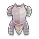 Iron Armor VIII

</li>
<li>

 Garman Plate Armor VIII

</li>
<li>

 Cat’s Blessing II

</li>
<li>

 Glow Metal× 16

</li>
<li>

 Chaotic Metal× 8

</li>
<li>

 Semiconductor× 2000

</li>
<li>

 Warrior’s Will× 8

</li>
<li>

 Moldy Gold Coins× 1000

</li>
<li>

 Zeny× 800 000

</li>
</ul>
<h2 id="img-src.synth_finmagic_abyss.png--magic-abyss"> Magic Abyss</h2>
<ul>
<li>

Деф +196

</li>
<li>

Int, Vit, &amp; Dex +8

</li>
<li>

Макс  ХП +3,500

</li>
<li>

M.Деф +10%

</li>
<li>

Каждая 1 единица заточки увеличивает Деф by 1%.

</li>
<li>

Когда Agi достигает 120, M.Atk +5%. Когда Int достигает 200 ASPD +5%.

</li>
<li>

M.Atk +7% &amp; Макс ХП +5%. При заточке на +5, увеличивает M.Atk +3%. При заточке на +10, увеличивает Игнор M.Деф &amp; Attack  Spd +5%. При заточке на +15, увеличивает M.Atk &amp; Игнор M.Деф +5%.

</li>
<li>

Начиная с уровня заточки +8, каждая заточка на +1 увеличивает Игнор M.Деф на 2% (до 16%).

</li>
<li>

Magic Abyss + Sage Diary VIII: Шанс  срабатывания Double Flurry +3%. Магический урон +5%

</li>
</ul>
<h3>Предметы для синтеза:</h3>
<ul>
<li>

 Surging Magic Robe IV

</li>
<li>

 Silver Robe VI

</li>
<li>

 Silk Robe VI

</li>
<li>

 Glow Metal× 16

</li>
<li>

 Warrior’s Will× 8

</li>
<li>

 Chemical Gas Cylinder× 2000

</li>
<li>

 Wicked Heart× 8

</li>
<li>

 Moldy Gold Coins× 1000

</li>
<li>

 Zeny× 800 000

</li>
</ul>
<h2 id="img-src.synth_finmadman.png--madmans-jacket"> Madman’s Jacket</h2>
<ul>
<li>

Деф +196

</li>
<li>

Dex &amp; Agi +10

</li>
<li>

Atk +4%

</li>
<li>

Макс  ХП +3,600

</li>
<li>

Деф +10%

</li>
<li>

Каждая 1 единица заточки увеличивает M.Деф by 1%.

</li>
<li>

При заточке на +5, увеличивает Atk +3% &amp; Игнор  Деф +4%. При заточке на +10, если экипированы кинжалы, Atk +5% &amp; Игнор  Деф +8%. Если экипирован лук, дальняя физическая Atk +8% &amp; Игнор  Деф +5%. При заточке на +15, увеличивает +5% физический урон.

</li>
<li>

Начиная с уровня заточки +8, каждая заточка на +1 увеличивает Atk  на 1% &amp; Игнор  Деф на 1% (до 8%).

</li>
<li>

Black Wing V + Madman’s Jacket: Str +5, Игнор  Деф +10%

</li>
</ul>
<h3>Предметы для синтеза:</h3>
<ul>
<li>

 Bohemian Coat VIII

</li>
<li>

 Garman Plate Armor VIII

</li>
<li>

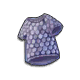 Saphien’s Armor Of Ocean

</li>
<li>

 Glow Metal× 16

</li>
<li>

 Wicked Heart× 8

</li>
<li>

 Iron Ore× 2000

</li>
<li>

 Warrior’s Will× 8

</li>
<li>

 Moldy Gold Coins× 1000

</li>
<li>

 Zeny× 800 000

</li>
</ul>
<h2 id="img-src.synth_fincomet.png--comet-warfare-armor">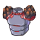 Comet Warfare Armor</h2>
<ul>
<li>

Деф +196

</li>
<li>

Сопротивляемость к Стану и Заморозке +50%

</li>
<li>

Макс  ХП +4,000

</li>
<li>

Деф +10%

</li>
<li>

Каждая 1 единица заточки увеличивает M.Деф by 1%.

</li>
<li>

Petrify Res +10%. За каждый +1 к уровню заточки увеличивает сопротивляемость окаменению на 1%.

</li>
<li>

Fear Resist +10%. За каждый +1 к уровню заточки увеличивает сопротивляемость окаменению на 1%.

</li>
<li>

При заточке на +5, увеличивает Макс ХП +2%. При заточке на +10, увеличивает Макс ХП +3%. При заточке на +15, увеличивает Макс ХП +5%.

</li>
<li>

Начиная с уровня заточки +8, каждая заточка на +1 снижает получаемый урон от нейтрала, ветра, земли, воды и огня на 1% (до 8%).

</li>
</ul>
<h3>Предметы для синтеза:</h3>
<ul>
<li>

 Meteorite Armor VI

</li>
<li>

 Garman Plate Armor VIII

</li>
<li>

 Panties III

</li>
<li>

 Glow Metal× 16

</li>
<li>

 Wicked Heart× 8

</li>
<li>

 Semiconductor× 2000

</li>
<li>

 Warrior’s Will× 8

</li>
<li>

 Moldy Gold Coins× 1000

</li>
<li>

 Zeny× 800 000

</li>
</ul>
<h2 id="img-src.synth_finmoon_gown.png--moon-gown"> Moon Gown</h2>
<ul>
<li>

Деф +196

</li>
<li>

Dex +14 &amp; Luk +4

</li>
<li>

Atk +6%

</li>
<li>

Макс СП +300

</li>
<li>

Макс  ХП +3,500

</li>
<li>

M.Деф +10%

</li>
<li>

Каждая 1 единица заточки увеличивает Деф by 1%.

</li>
<li>

Урон  от  Arrow Shower (Raging Storm) +10%

</li>
<li>

Начиная с уровня заточки +5, каждая последующая заточка на +1 увеличивает урон Arrow  Shower (Raging  Storm) на 1% (до 10%).

</li>
<li>

При заточке на +5, увеличивает Dex +2 &amp; Atk +4%. При заточке на +10, увеличивает Dex +2 &amp; Atk +4%. При заточке на +15, увеличивает  Dex +2 &amp; Atk +6%.

</li>
<li>

Начиная с уровня заточки +8, каждая заточка на +1 увеличивает Проникновение на 1% (до 8%).

</li>
</ul>
<h3>Предметы для синтеза:</h3>
<ul>
<li>

 Elegant Uniform IV

</li>
<li>

 Deathcat Armor VI

</li>
<li>

 Panties VI

</li>
<li>

 Glow Metal× 16

</li>
<li>

 Warrior’s Will× 8

</li>
<li>

 Iron Ore× 2000

</li>
<li>

 Chaotic Metal× 8

</li>
<li>

 Moldy Gold Coins× 1000

</li>
<li>

 Zeny× 800 000

</li>
</ul>
<h2 id="img-src.synth_fingods.png--gods’-blessings"> Gods’ Blessings</h2>
<ul>
<li>

Деф +205

</li>
<li>

Vit +20

</li>
<li>

Макс ХП +12%

</li>
<li>

Макс ХП +4,500

</li>
<li>

Макс СП +500

</li>
<li>

Макс СП +5%

</li>
<li>

Деф +10%

</li>
<li>

Каждая 1 единица заточки увеличивает M.Деф by 1%.

</li>
<li>

Каждая 1 единица заточки увеличивает Макс ХП by 1%.

</li>
<li>

Снижает получаемый урон от яда, святости, тьмы и призрачного элемента на -10%.

</li>
<li>

Начиная с уровня заточки +8, каждая заточка на +1 снижает получаемый урон от нейтрала, яда, святости, тьмы и призрачного элемента на 1% (до 8%).

</li>
</ul>
<h3>Предметы для синтеза:</h3>
<ul>
<li>

 Goibne’s Armor X

</li>
<li>

 Orleans’s Gown VIII

</li>
<li>

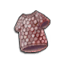 Lucius’s Fierce Armor Of Volcano

</li>
<li>

 Glow Metal× 16

</li>
<li>

 Chaotic Metal× 8

</li>
<li>

 Semiconductor× 2000

</li>
<li>

 Wicked Heart× 8

</li>
<li>

 Moldy Gold Coins× 1000

</li>
<li>

 Zeny× 800 000

</li>
</ul>
<h2 id="img-src.synth_finfloating.png--floating-cloud-clothes"> Floating Cloud Clothes</h2>
<ul>
<li>

Деф +196

</li>
<li>

M.Деф +75

</li>
<li>

Int, Vit, &amp; Dex +8

</li>
<li>

Макс ХП +4,000

</li>
<li>

Макс ХП +5%

</li>
<li>

Макс СП +5%

</li>
<li>

M.Деф +10%

</li>
<li>

Каждая 1 единица заточки увеличиваетД еф by 1%.

</li>
<li>

При заточке на +5, +10, и +15, и использования любых музыкальных умений, весь получаемый урон снижен на 5%, 5%, и 10% соответственно.

</li>
<li>

Каждая 1 единица заточки увеличивает Макс ХП by 1%.

</li>
<li>

Начиная с уровня заточки +8, каждая заточка на +1 снижает получаемый магический и физический урон на 1% (до 8%).

</li>
<li>

Floating Cloud Clothes + Dancing Shoes IV + Wandering Bard’s Garments IV: Макс ХП +10%, Vit +5

</li>
</ul>
<h3>Предметы для синтеза:</h3>
<ul>
<li>

 Elaborate Costume IV

</li>
<li>

 Deathcat Armor VI

</li>
<li>

 Cat’s Blessing VI

</li>
<li>

 Glow Metal × 16

</li>
<li>

 Chaotic Metal × 8

</li>
<li>

 Chemical Gas Cylinder× 2000

</li>
<li>

 Wicked Heart× 8

</li>
<li>

 Moldy Gold Coins× 1000

</li>
<li>

 Zeny× 800 000

</li>
</ul>
<h2 id="img-src.synth_findawn.png--dawn-clothes"> Dawn Clothes</h2>
<ul>
<li>

Деф +196

</li>
<li>

Int +20

</li>
<li>

Макс  ХП +3,500

</li>
<li>

Макс СП +200

</li>
<li>

Переменное время каста -5%

</li>
<li>

M.Atk +5%

</li>
<li>

M.Деф +10%

</li>
<li>

Каждая 1 единица заточки увеличивает Деф by 1%.

</li>
<li>

Затрата Blue  Gemstone  на умение Adoramus  -1.

</li>
<li>

При заточке на +5, увеличивает множитель Adoramus’s  Skill  до +50% &amp; Игнор M.Деф +5%. При заточке на +10, увеличивает множитель Adoramus’s  Skill  до +100% &amp; Игнор M.Деф +5%. При заточке на +15, увеличивает множитель Adoramus’s  Skill  до +150% &amp; M.Atk +10%.

</li>
<li>

Начиная с уровня заточки +8, каждая заточка на +1 увеличивает Игнор M.Деф by 2% (up  to 16%).

</li>
</ul>
<h3>Предметы для синтеза:</h3>
<ul>
<li>

 Robe Of Judgment IV

</li>
<li>

 Silver Robe VIII

</li>
<li>

 Exorcist Robe V

</li>
<li>

 Glow Metal× 16

</li>
<li>

 Warrior’s Will× 8

</li>
<li>

 Chemical Gas Cylinder× 2000

</li>
<li>

 Chaotic Metal× 8

</li>
<li>

 Moldy Gold Coins× 1000

</li>
<li>

 Zeny× 800 000

</li>
</ul>
<h2 id="img-src.synth_finbright.png--bright-armor">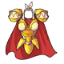 Bright Armor</h2>
<ul>
<li>

Деф +205

</li>
<li>

Vit +15

</li>
<li>

Макс  ХП +4,000

</li>
<li>

Деф +10%

</li>
<li>

Каждая 1 единица заточки увеличивает M.Деф by 1%.

</li>
<li>

Если ваш гомункул - Lif, восстановление ХП и СП +12, а Фиксированная скорость каста Acid  Terror, Improved  Acid  Demonstration  -0.5 sec.

</li>
<li>

Если ваш гомункул - Amistr, Atk +12%

</li>
<li>

Если ваш гомункул - Vanilmirth, M.Atk +12%

</li>
<li>

Если ваш гомункул - Eleanor, Проникновение +6%.

</li>
<li>

При заточке на +5, увеличивает M.Atk &amp; Atk +3%. При заточке на +10, увеличивает M.Atk &amp; Atk +5%. При заточке на +15, увеличивает Atk &amp; M.Atk +7%.

</li>
<li>

Начиная с уровня заточки +8, каждая заточка на +1 увеличивает Игнор  Деф на 2% (до 16%).

</li>
</ul>
<h3>Предметы для синтеза:</h3>
<ul>
<li>

 Alloy Armor VIII

</li>
<li>

 Garman Plate Armor VI

</li>
<li>

 Panties III

</li>
<li>

 Glow Metal× 16

</li>
<li>

 Wicked Heart× 8

</li>
<li>

 Semiconductor× 2000

</li>
<li>

 Chaotic Metal× 8

</li>
<li>

 Moldy Gold Coins× 1000

</li>
<li>

 Zeny× 800 000

</li>
</ul>
<h2 id="img-src.synth_finwatcher.png--watchers-armor"> Watcher’s Armor</h2>
<ul>
<li>

Деф +273

</li>
<li>

Vit +15

</li>
<li>

Макс ХП +15%

</li>
<li>

Макс ХП +6,000

</li>
<li>

Деф +10%

</li>
<li>

Каждая 1 единица заточки увеличивает M.Деф by 1%.

</li>
<li>

Бонусное лечение +5%. При заточке на +5, увеличивает Бонусное лечение +5% &amp; Получаемый Критический урон -5%. При заточке на +10, увеличивает Бонусное лечение +10% &amp; Получаемый Критический урон -10%. При заточке на +15, Получаемый Критический урон -15%.

</li>
<li>

Каждая 1 единица заточки увеличивает Макс ХП на 1% и снижает получаемый урон от ветра, земли, воды, огня и святости на 1%.

</li>
<li>

Начиная с уровня заточки +8, каждая заточка на +1 снижает получаемый магический и физический урон на 1% (до 8%).

</li>
</ul>
<h3>Предметы для синтеза:</h3>
<ul>
<li>

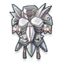 Legion Plate Armor VIII

</li>
<li>

 Deathcat Armor VI

</li>
<li>

 Cat’s Blessing III

</li>
<li>

 Glow Metal× 16

</li>
<li>

 Chaotic Metal× 8

</li>
<li>

 Semiconductor× 2000

</li>
<li>

 Wicked Heart× 8

</li>
<li>

 Moldy Gold Coins× 1000

</li>
<li>

 Zeny× 800 000

</li>
</ul>
<h2 id="img-src.synth_finshinewhole.png--shinewhole’s-robe"> Shinewhole’s Robe</h2>
<ul>
<li>

Деф +196

</li>
<li>

Деф +50

</li>
<li>

VIT +10 и Str +10

</li>
<li>

Макс  ХП +3,600

</li>
<li>

ASPD Экипировки +5%

</li>
<li>

Критический  урон +5%

</li>
<li>

За каждые 200 очков Макс ХП игрок получает 1 Atk (до 1,500 ATK)

</li>
</ul>

M.Деф +10%

<ul>
<li>

Каждый уровень заточки повышает Деф +1%.

</li>
<li>

При заточке на +5 и экипировки дубин и кастетов, Atk +5%. При заточке на +10 и экипировки дубин и кастетов, Крит +2 &amp; Критический урон +10%. При заточке на +15 и экипировки дубин и кастетов, Крит +3 &amp; Критический урон +15%.

</li>
<li>

Начиная с уровня заточки +8, каждая заточка на +1 увеличивает Критический урон на 2% (до 16%).

</li>
<li>

Slash V + Shinewhole’s Robe: Attack Spd +5%, Atk +5%

</li>
</ul>
<h3>Предметы для синтеза:</h3>
<ul>
<li>

 Saint’s Cape VIII

</li>
<li>

 Silver Robe VIII

</li>
<li>

 Lucius’s Fierce Armor Of Volcano

</li>
<li>

 Glow Metal× 16

</li>
<li>

 Chaotic Metal× 8

</li>
<li>

 Chemical Gas Cylinder× 2000

</li>
<li>

 Warrior’s Will× 8

</li>
<li>

 Moldy Gold Coins× 1000

</li>
<li>

 Zeny× 800 000

</li>
</ul>
<h2 id="img-src.synth_fintyre.png--tyres-armor"> Tyre’s Armor</h2>
<ul>
<li>

Деф +196

</li>
<li>

Agi &amp; Dex +10

</li>
<li>

Макс  ХП +3,500

</li>
<li>

Attack Spd +10%

</li>
<li>

Flee +25

</li>
<li>

M.Деф +10%

</li>
<li>

Каждая 1 единица заточки увеличивает Деф by 1%.

</li>
<li>

Когда Luk  достигает 60, Crit  DMG +3%. Когда Luk  достигает 90, Crit  DMG +4%. Когда Luk достигает 120, Crit DMG +5%

</li>
<li>

Критический урон +5%. При заточке на +5, увеличивает Критический урон +4%. При заточке на +10, увеличивает Критический урон +6%. При заточке на +15, увеличивает Критический урон +8%.

</li>
<li>

Критические удары при автоатаке имеют 10% шанс дать игроку увеличение Atk +5% на 5 секунд.

</li>
<li>

Начиная с уровня заточки +8, каждая заточка на +1 увеличивает Проникновение на 1% (до 8%).

</li>
<li>

Malang Snow Crab IV + Tyre’s Armor: Agi +5, Критический урон +10%

</li>
</ul>
<h3>Предметы для синтеза:</h3>
<ul>
<li>

 Sniping Suit VIII

</li>
<li>

 Angelic Protection VIII

</li>
<li>

 Claytos Cracking Earth Armor

</li>
<li>

 Glow Metal× 16

</li>
<li>

 Wicked Heart× 8

</li>
<li>

 Iron Ore× 2000

</li>
<li>

 Warrior’s Will× 8

</li>
<li>

 Moldy Gold Coins× 1000

</li>
<li>

 Zeny× 800 000

</li>
</ul>
<h2 id="img-src.synth_finninja.png--ninja-clothes·cold-night-song"> Ninja Clothes·Cold Night Song</h2>
<ul>
<li>

Деф +196

</li>
<li>

Luk +20 &amp; Str +8

</li>
<li>

Attack Spd +10%

</li>
<li>

Макс  ХП +3,600

</li>
<li>

Деф +10%

</li>
<li>

Каждая 1 единица заточки увеличивает M.Деф by 1%.

</li>
<li>

Когда Luk  достигает 70, Критический урон +3%. Когда Luk  достигает 100, Критический урон +5%. Когда Luk  достигает 130, Критический урон +7%.

</li>
<li>

Урон  в  ближнем  бою+4%

</li>
<li>

При заточке на +5, урон большим мобам увеличен на 5%. При заточке на +10, урон в ближнем бою увеличен на 4%. При заточке на +15, урон в ближнем бою увеличен на +8%.

</li>
<li>

Начиная с уровня заточки +8, каждая заточка на +1 увеличивает физический урон на 1% (до 8%).

</li>
</ul>
<h3>Предметы для синтеза:</h3>
<ul>
<li>

 Ninja Suit Moonlight VIII

</li>
<li>

 Angelic Protection VIII

</li>
<li>

 Aebecee’s Raging Typhoon Armor

</li>
<li>

 Glow Metal× 16

</li>
<li>

 Wicked Heart× 8

</li>
<li>

 Iron Ore× 2000

</li>
<li>

 Chaotic Metal× 8

</li>
<li>

 Moldy Gold Coins× 1000

</li>
<li>

 Zeny× 800 000

</li>
</ul>
<h2 id="img-src.synth_findark_star.png--dark-star-stealth-clothes"> Dark Star Stealth Clothes</h2>
<ul>
<li>

Деф +196

</li>
<li>

Dex +20

</li>
<li>

Atk +12%

</li>
<li>

Макс  ХП +3,500

</li>
<li>

Деф +10%

</li>
<li>

Каждая 1 единица заточки увеличивает M.Деф by 1%.

</li>
<li>

Увеличивает Int  от эффекта Falcon  Force. Когда Int  достигает 180, увеличивает Atk  эффекта Falcon  Force.

</li>
<li>

Заточка +5 увеличивает Atk +3%. Заточка +10 увеличивает Atk +5%. Заточка +15 увеличивает Atk +7%. Увеличивает Atk  эффекта Falcon  Force.

</li>
<li>

Начиная с уровня заточки +8, каждая заточка на +1 увеличивает физический урон на 1% (до 8%).

</li>
<li>

Cursed Lyre IV + Dark Star Stealth Clothes: увеличивает Atk эффектов Beast Attack.

</li>
</ul>
<h3>Предметы для синтеза:</h3>
<ul>
<li>

 Ranger Clothes VIII

</li>
<li>

 Orleans’s Gown VIII

</li>
<li>

 Saphien’s Armor Of Ocean

</li>
<li>

 Glow Metal× 16

</li>
<li>

 Warrior’s Will× 8

</li>
<li>

 Iron Ore× 2000

</li>
<li>

 Chaotic Metal× 8

</li>
<li>

 Moldy Gold Coins× 1000

</li>
<li>

 Zeny× 800 000

</li>
</ul>
<h2 id="img-src.synth_fingreed.png--greed-shirt"> Greed Shirt</h2>
<ul>
<li>

Деф +243

</li>
<li>

Str, Vit, &amp; Dex +10

</li>
<li>

Макс  ХП +4,000

</li>
<li>

Деф +10%

</li>
<li>

Каждая 1 единица заточки увеличивает M.Деф by 1%.

</li>
<li>

При заточке на +5 при использовании топоров увеличивает физический урон +3%. При заточке на +10 при использовании топоров, увеличивает физический урон +5%. При заточке на +15 при использовании топоров, увеличивает физический урон +7%.

</li>
<li>

При заточке на +10 и выше при использовании топоров, каждаю последующая заточка на +1 увеличивает Atk  на 1% (до 5%) и Макс ХП на 1% (до 5%).

</li>
<li>

Начиная с уровня заточки +8, каждая заточка на +1 увеличивает Atk  на 2% (до 16%).

</li>
</ul>
<h3>Предметы для синтеза:</h3>
<ul>
<li>

 Glittering Jacket VIII

</li>
<li>

 Angelic Protection VIII

</li>
<li>

 Cat’s Blessing II

</li>
<li>

 Glow Metal× 16

</li>
<li>

 Wicked Heart× 8

</li>
<li>

 Chemical Gas Cylinder× 2000

</li>
<li>

 Warrior’s Will× 8

</li>
<li>

 Moldy Gold Coins× 1000

</li>
<li>

 Zeny× 800 000

</li>
</ul>
<h2 id="img-src.synth_finbreath.png--breath-holder’s-armor"> Breath Holder’s Armor</h2>
<ul>
<li>

Деф +205

</li>
<li>

M.Деф +80

</li>
<li>

Agi +12 &amp; Str +18

</li>
<li>

Макс  ХП +4,000

</li>
<li>

Деф +10%

</li>
<li>

Каждая 1 единица заточки увеличивает M.Деф by 1%.

</li>
</ul>

-При использовании кинжалов, увеличивает Atk +6%. При заточке на +5 при использовании кинжалов, увеличивает Atk +4%. При заточке +10 при использовании кинжалов, увеличивает Atk +5% &amp; Игнор  Деф +5%. При заточке +15 при использовании кинжалов, увеличивает Atk +5% &amp; Игнор  Деф +10%.

<ul>
<li>

Начиная с уровня заточки +8, каждая заточка на +1 увеличивает Atk  на 1% &amp; Игнор  Деф на 1% (до 8%).

</li>
<li>

Holy  Dagger  VIII + Breath  Holder’s  Armor: Урон по малым мобам +15%, Урон по средним мобам +5%, Урон по большим мобам +10%

</li>
</ul>
<h3>Предметы для синтеза:</h3>
<ul>
<li>

 Thief Clothes VIII

</li>
<li>

 Angelic Protection VIII

</li>
<li>

 Panties II

</li>
<li>

 Glow Metal × 16

</li>
<li>

 Wicked Heart × 8

</li>
<li>

 Chemical Gas Cylinder × 2000

</li>
<li>

 Chaotic Metal × 8

</li>
<li>

 Moldy Gold Coins× 1000

</li>
<li>

 Zeny× 800 000

</li>
</ul>

