<h1 id="башня-танатоса">Башня Танатоса</h1>
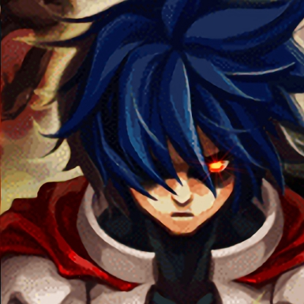

В эпизоде 6.0 вводится новый данж, в который можно (и нужно) ходить двумя патьками, объединёнными в альянс. Подземелье может быть довольно тяжёлым и требует слаженной работы всех людей в альянсе.

<h2 id="вход-в-башню">Вход в башню</h2>
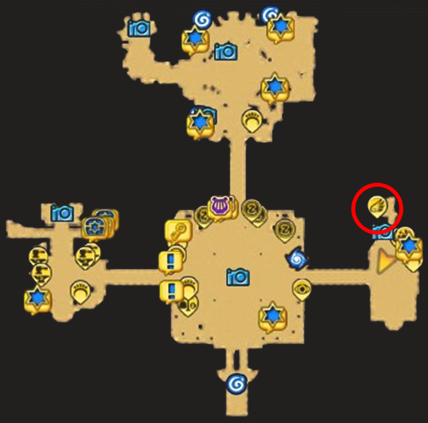

Чтобы попасть на остров, где находится башня, нужно поговорить с НПЦ Karthaus Airship Manager, который находится в восточной части Юно.

После того, как вы попали на остров, здесь можно активировать телепорт, чтобы не бегать в следующий раз сюда пешком.

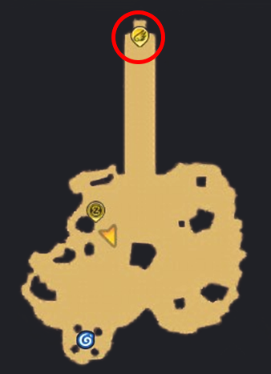

Чтобы попасть в башню нужно поговорить с НПЦ Gageel Ruin Administrator около входа.

После разговора с ним всем членам альянса будет предложено в последний раз посмотреть на сформированные патьки. Если патьки сформированы правильно (все члены альянса это подтвердили), то после повторного разговора с НПЦ появляется окно, где каждый член альянса должен дать согласие на заход в башню.

<h2 id="общая-информация">Общая информация</h2>

В башне есть 2 режима: novice и brave.

Число попыток прохождения каждого из этапов не ограничено. Вы можете выходить из башни, пересобирать патьки, и так далее. Ваш прогресс не обнулится, и башня не закроется.

На каждом этаже башни у альянса есть ограниченное количество воскрешений (60 штук). Если вы используете их все, то больше на данной попытке воскрешать будет нельзя.

Попытка считается неуспешной, если все игроки в альянсе мертвы, или при достижении определённых условий.

<h2 id="награды">Награды</h2>

За прохождение каждого этажа вы можете получить определённые награды

<h3 id="этаж">1 этаж</h3>
<ul>
<li>

Зени

</li>
<li>

Руны класса B

</li>
<li>

Руны класса A

</li>
<li>

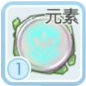Руны Характеристик 1 уровня

</li>
<li>

Rune  Coin

</li>
<li>

Редкие предметы

</li>
</ul>
<h3 id="этаж-1">2 этаж</h3>
<ul>
<li>

Зени

</li>
<li>

Руны класса B

</li>
<li>

Руны класса A

</li>
<li>

Руны Характеристик 1 уровня

</li>
<li>

Rune  Coin

</li>
<li>

Редкие предметы

</li>
</ul>
<h3 id="этаж-2">3 этаж</h3>
<ul>
<li>

Зени

</li>
<li>

Руны класса B

</li>
<li>

Руны класса A

</li>
<li>

Руны класса S

</li>
<li>

Руны Характеристик 1 уровня

</li>
<li>

Rune  Coin

</li>
<li>

Редкие предметы

</li>
</ul>
<h3 id="этаж-3">4 этаж</h3>
<ul>
<li>

Зени

</li>
<li>

Руны класса A

</li>
<li>

Руны класса S

</li>
<li>

Руны Характеристик 1 уровня

</li>
<li>

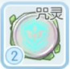Руны Характеристик 2 уровня

</li>
<li>

Rune  Coin

</li>
<li>

Ездовое животное

</li>
<li>

Редкие предметы

</li>
</ul>
<h2 id="прохождение">Прохождение</h2>
<h3 id="этаж-4">1 этаж</h3>
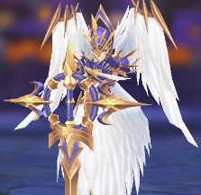

На этом этаже босс – Valkyrie  Rathgricy. Бессмертная валькирия, которая копит силу, чтобы мгновенно убить всех на карте. Задача – убить её прежде, чем она накопит свою силу полностью.

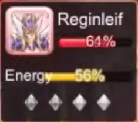

Справа у босса есть небольшой интерфейс, где верхняя полоса – жизни Валькирии, нижняя – её энергия.

Начинается бой с того, что танк и прист агрят валькирию на себя. Удары Валькирии может выдержать средненький танк, а прист просто поддерживает его уровень здоровья.

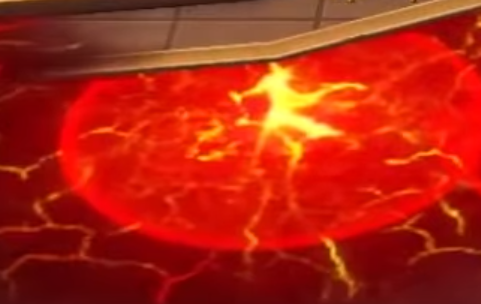

Важное замечание здесь – танк должен именно водить валькирию, так как иногда она будет кастовать под себя огненную землю, стоя на которой Валькирия будет очень быстро накапливать энергию.

Остальные игроки делают Валькирию уязвимой. Для этого необходимо уничтожать кристаллы, находящиеся по бокам холла.

В центре карты будут появляться защитники (Zealot’s  Blade и Blade  of  Order). На карте они у вас будут отмечены синим или красным цветом.

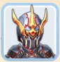

Задача на этом этапе – подвести синих защитников на красные кристаллы, а красных защитников на синие кристаллы и убить их. Когда все кристаллы будут уничтожены, Валькирия станет уязвимой.

На этапе, когда Валькирия уязвима, нужно сфокусировать всю свою атаку на неё, изредка переключаясь на мобов (Crystal  Immolator), которые могут чинить кристаллы. В целом, если у вас хороший ДПС, то Crystal  Immolator  даже не успеют появиться, так как бой с уязвимой Валькирией длится не больше минуты.

<h3 id="этаж-5">2 этаж</h3>
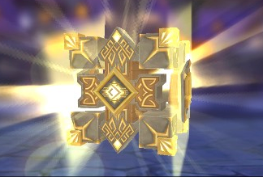

На этом этаже босс – Tesseract. Моб, похожий на куб, который не двигается и бьёт большое количеством АОЕ умений.

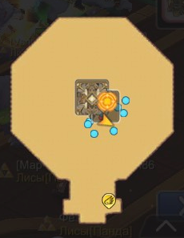

Босс будет призван после того, как были убиты все 12 мобов на этаже. После появления босса, начинайте его бить. Его основные атаки – взрывающиеся круги на земле и связка двух случайных игроков. С кругами всё легко - выбегайте из них до того, как они взорвутся. Вместе со связкой двух игроков появляется вертикальный луч, который наносит небольшой урон. Ваша задача – сделать так, чтобы этот вертикальный луч «разрезал» вашу связку.

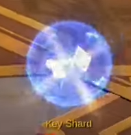

Вторая стадия босса начинается, когда его жизни становятся равны 20%. Босс становится неуязвимым. Для его убийства вы должны в течение двух минут бегать по карте и подбирать 5 ключей, которые надо поднести НПЦ, стоящему рядом с боссом. Кликать на НПЦ не требуется. Достаточно просто подбежать к нему с ключом, он будет сдан автоматически.

<h3 id="этаж-6">3 этаж</h3>

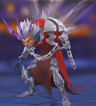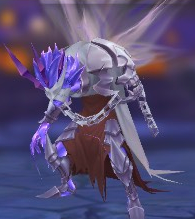

На этом этаже вы столкнётесь не только с двумя боссами – частями души Танатоса, но и с множеством нюансов, которые нужно знать, пока вы бьётесь с ним.

Чтобы инициировать битву с боссом, члены альянса должны поднять 5 сфер, находящихся на карте.

При инициации под каждым игроком можно увидеть ауру (фиолетовую или жёлтую). Эти же ауры дублируются в правой части экрана (слева от аватарок боссов). Это значит, что вы находитесь под аурой одного из боссов (Sorrow или Worry). Для большей эффективности вам нужно бить босса, под чьей аурой вы находитесь, то есть вам нужно выбрать внутренний или внешний круг. Для удобства – обратите внимание на цвет пола внутренней и внешней зоны. Цвет вашей ауры должен совпадать с цветом пола. То есть, если у вас жёлтая аура, вы должны стоять во внешнем кругу, а если фиолетовая, то внутренняя. На картинке выше показано неверное расположение персонажей (наш первый заход). Люди, которые подняли защитные сферы, могут находиться в любом круге.

Спустя ~5 секунд после инициации битвы, поле делится на две части – внешнюю и внутреннюю. В каждой из этих частей обитает часть души Танатоса.

Во внутренней и внешней частях должны быть свои присты, свои танки. Желательно обоим патькам располагаться приблизительно в одном месте, разделённым барьером, чтобы присты могли кидать деревья, которые бы ресали обе патьки. Единственное – боссы своими АОЕ умениями могут попадать сквозь барьер, поэтому выбирайте место хорошо! На данном этапе сильно помогает Safety  Wall  Визов/Пристов, так как оба босса бьют ближней атакой.

Иногда боссы будут накладывать на двух случайных персонажей ауру, которая через некоторое время взорвётся. Для избжания получения урона всей патькой, людям, на которых применили этот спелл, необходимо отойти от основной патьки.

На этом этапе вы просто поддерживаете постоянный урон по боссам. Жизни у них общие, сливаются они одновременно. Спустя 1 минуту после начала битвы, во внутреннем круге появится фиолетовое сердце (оно будет также видно на миникарте). Это сердце необходимо уничтожить, в противном случае, оно существенно восстановит жизнь боссам. Прочность каждого нового сердца повышает прочность предыдущего. Необходимо закончить битву как можно быстрее.

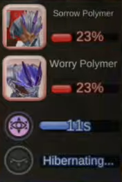

Параллельно с сердцем в правой части экрана (под аватарками боссов) начинается обратный отсчёт с 20. Это заряжается сверхмощный взрыв во внутреннем или во внешнем круге. Верхняя строчка означает, что взрыв произойдёт внутри, нижняя строчка – снаружи. Для того, чтобы избежать смерти от взрыва, необходимо уничтожить фиолетовое сердце. После его уничтожения откроется секция стены, разделяющая внутренний и внешний круг, после чего люди, в круге которых готовятся взрыв, должны вбежать через открывшуюся секцию стены в другой круг. Когда таймер становится равным 0, происходит взрыв, состоящий из 3 волн.

После взрыва у некоторых игроков может измениться цвет их ауры. Необходимо быстро сориентироваться и переместиться в круг к боссу, наложившему на вас соответствующий статус. Спустя 5 секунд после взрыва недостающая секция стены будет восстановлена, битва продолжится.

<h3 id="этаж-7">4 этаж</h3>
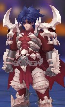

Последний босс – Танатос. Самый тяжёлый босс, с тяжёлой стратегией и своими нюансами.

Битва разделена на 3 фазы, сложнейшая из которых – фаза 2.

Во время первой фазы вам нужно подбежать к боссу, чтобы его сагрить. Место, где вы будете бить босса в течение первой фазы не имеет особого значения, поэтому можете его бить по центру, а можете – ближе к окружности. Во время этой битвы вы будете накапливать ярость.

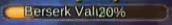

Свою ярость вы можете увидеть прямо под вашим ником (оранжевая или красная полоса). При достижении каким-либо игроком в альянсе значения ярости, равное 40%, будут призваны мобы, которые будут вам мешать и повышать ярость дальше. Когда ярость достигнет 100%, будет скастовано огромное АОЕ, которое убьёт всех персонажей, а попытку нужно будет повторить.

Есть 4 способа получить ярость:

<ul>
<li>

Вокруг двух случайных игроков в альянсе образуется ярко красные круги. Этим игрокам нужно отбежать от своих товарищей, так как примернно через 3-5 секунд произойдёт взрыв, который нанесёт небольшой урон и немного заполнит вашу шкалу ярости.

</li>
<li>

На земле образуется бледно красные круги, которые взорвуться примерно через 5 секунд, что нанесёт небольшой урон и немного заполнит шкалу ярости тех, кто оказался внутри.

</li>
<li>

Танатос может использовать на вас умение, которые вы увидите в правой части экрана (слева от аватарки босса).  Умение представлено фиолетовым полем. Когда на вас это поле, вам нужно немедленно прекратить бить Танатоса и мобов. Эффект снимется сам через 5 секунд.

</li>
<li>

Когда вас бьют мобы.

</li>
</ul>

Снизить свой уровень ярости можно, уничтожая сферы песочного цвета. После их уничтожения на некоторое время (секунд на 20) появляется зона песочного цвета. Нахождение в этой зоне способствует медленному снижению вашего уровня ярости.

После снижения жизней Танатоса до 60%, он входит во вторую фазу. При переходе во вторую фазу ярость всех игроков снижается до 8%, вне зависимости от прежнего уровня. В этой фазе Танатос телепортируется к своему мечу в центре карты, и появляется большой жёлтый купол. На этом этапе необходимо находиться внутри купола. Нахождение вне купола быстро накапливает вашу ярость. Хотя бы один живой человек должен находиться внутри купола. Если этого не происходит, попытка мгновенно считается проваленной. Танатос, как и в первой фазе, будет кастовать огромные красные круги, которых надо избегать. Если значение вашей ярости достигло 40%, вы будете незамедлительно телепортированы в потусторонний мир.

  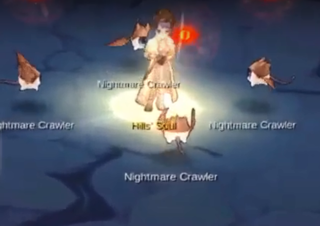

В потустороннем мире вас встретят Фриони и Бехолдеры. На 6 часов стоит НПЦ, который может вас в целости и сохранности телепортировать в зал Танатоса, однако учтите, что задержка между телепортациями – 20 секунд. Если вы сюда попали, рекомендуется первым делом дать выйти пристам и танкам, чтобы они могли вернуться в битву с Танатосом. Что происходит в этой Зоне? Бехолдеры летят к НПЦ в центре и бьют его. Вы получаете урон вместе с ним, а ваша ярость быстро накапливается. Когда ваша ярость достигнет 100%, в зале Танатоса произойдёт большой взрыв. Вы умрёте в потустороннем мире и будете возвращены обратно в зал Танатоса, но в виде трупа. Если же Фриони доходят до меча, то в зале тоже происходит большой взрыв.

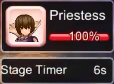

Когда жизнь Танатоса становится равной 0%, он переходит в свою третью фазу. Все, кто был в потустороннем мире телепортируются обратно в зал. На этой фазе единственное, что нужно – убегать от жрицы. Хотя бы один человек должен пережить 30 секунд, для чего люди альянса должны разбегаться и бегать по всей карте. Если это происходит, поздравляю, вы прошли подземелье! Для получения достижения и закрытия квеста, необходимо ударить жрицу хотя бы один раз!

