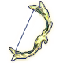
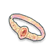
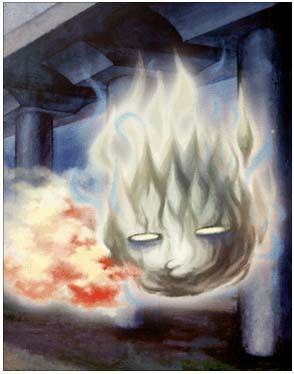
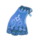
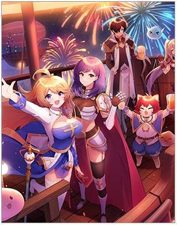
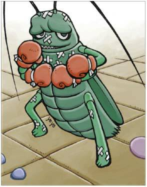
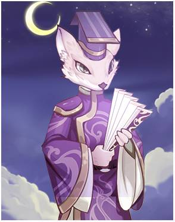
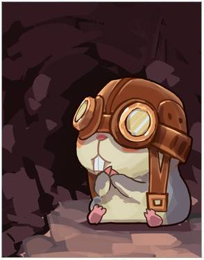

Материалы составлены гильдией "Лисы". Полный список гайдов и обсуждение нового эпизода в нашем дискорде: <a target="_blank" href="https://discord.gg/CK8mFcH"> https://discord.gg/CK8mFcH</a>

<h1 id="гайд-по-башне-танатоса-для-варлоков">Гайд по Башне Танатоса для Рейнджеров</h1>

Данный гайд составлен для целей его использования АДЛ Рейнджерами при прохождении 3-4 этажа Башни Танатоса.

<h2 id="экипировка">Экипировка</h2>

 Ввиду того, что у вас АДЛ билд, максимизация вашего игнора Дефа не требуется. Таким образом, вам нужно как можно эффективнее увеличивать силу своих ударов.

<table>
<thead>
<tr>
<th>Тип</th>
<th>Предмет</th>
<th>Карты</th>
</tr>
</thead>
<tbody>
<tr>
<td>Оружие</td>
<td> Bow Of The Wind Chaser +10 или  Overlord Crab Bow +10</td>
<td> Minorus x2</td>
</tr>
<tr>
<td>Вторая рука</td>
<td> Nile's Bracelet (VIII) +10</td>
<td> Dark Shadow Card (4-й этаж)</td>
</tr>
<tr>
<td>Накидка</td>
<td> Blueeve Cape +10</td>
<td> Celebration Collection</td>
</tr>
<tr>
<td>Броня</td>
<td> Dark Star Stealth Clothes +10 (при использовании Bow Of The Wind Chaser) или  Tyre's Armor +10 (при использовании Overlord Crab Bow)</td>
<td> Archer Skeleton ★</td>
</tr>
<tr>
<td>Ботинки</td>
<td> Advanced Sack Teddy Shoes (IV)</td>
<td> Male Thief Bug</td>
</tr>
<tr>
<td>Аксессуар 1</td>
<td> AGI Pin (VI) +10</td>
<td> Mao Guai (3-й этаж) и  Santa Poring (4-й этаж)</td>
</tr>
<tr>
<td>Аксессуар 2</td>
<td> Fairy In Bottle (IV) +10</td>
<td> Mao Guai (3-й этаж) и  Santa Poring (4-й этаж)</td>
</tr>
<tr>
<td>Голова</td>
<td>-</td>
<td> Martin (4-й этаж)</td>
</tr>
<tr>
<td>Рот</td>
<td> Blow gun +10</td>
<td>-</td>
</tr>
<tr>
<td>Спина</td>
<td> Adventurer Bag +10</td>
<td>-</td>
</tr>
</tbody>
</table>
Вместе с экипировкой, разумеется, вам нужно поднимать свою атаку и прочние нужные статы из справочника, дома и так далее.

Основная задача у рейнджера - выдавать хороший урон на 3 и на 4 этажах. Сильнее рейнджеров могут быть только очень хорошо собранные мехи, а на 4 этаже - варлоки.

<h2 id="умения">Умения</h2>

-

<h2 id="руны-в-монументе">Руны в монументе</h2>

-

<h2 id="действия">Действия</h2>
<h3 id="третий-этаж">Третий этаж</h3>

На данном этаже вы внимательно смотрите на цвет зоны, где вам нужно находиться, и перемещаетесь туда.

Действия рейнджера довольно просты - постоянно поддерживать урон по боссам, немедленно переключаясь на сердца при их появлении. Не забывайте уклоняться от АоЕ урона, которого на 3 этаже полно.

<h3 id="четвёртый-этаж">Четвёртый этаж</h3>

 При заходе на этаж вы меняете ваши карты в аксессуарах. Действия рейнджеров на 4 этаже аналогичны действиям на 3 этаже.

На первой стадии босса цель рейнджеров - постоянно поддерживать урон. Если в пати нет виза, сфокусированного на появляющихся мобах, поставьте в меню автобоя "Защиту группы", чтобы менять цель на мобов при их появлении. Разумеется, здесь действуют общие правила - из всех красных кругов надо выходить. Также контролируйте, когда на вас вешается фиолетовый дебафф. В этот момент вам нужно прекратить атаковать до конца действия дебаффа.

На второй стадии рейнджеры всегда находятся под куполом. Основные задачи - поддерживать хороший урон по Танатосу и не улетать вниз. На этом этапе с вами не будет визов, поэтому поставить "Защиту группы" крайне рекомендуется. Если вы оказались внизу при переходе босса во вторую фазу (раньше первого виза), но выходите незамедлительно! Если же вы оказались внизу в любой другой момент - вы накапливаете 100% ярости и умираете. Когда у вас накопилось 90% ярости вы предупреждаете людей наверху, что через 5 секунд будет взрыв. Внизу, если нет поблизости виза (косякнули с чередованием или виз только один), вы можете стукнуть Фрионьку пару раз, чтобы она не дошла до центра.

