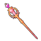
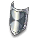
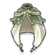
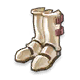
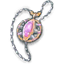
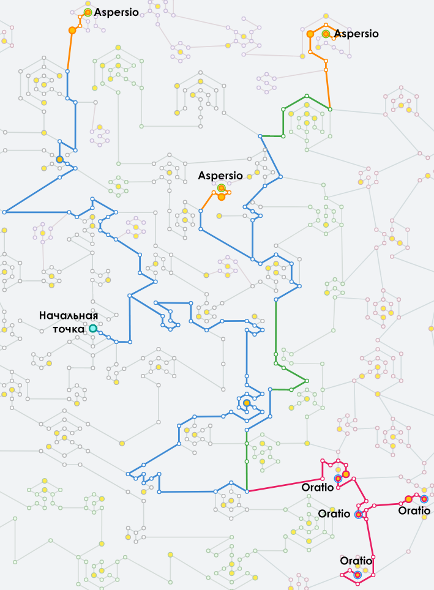

Материалы составлены гильдией "Лисы". Полный список гайдов и обсуждение нового эпизода в нашем дискорде: <a target="_blank" href="https://discord.gg/CK8mFcH"> https://discord.gg/CK8mFcH</a>

<h1 id="гайд-по-башне-танатоса-для-варлоков">Гайд по Башне Танатоса для Архиепископов</h1>

Данный гайд составлен для целей его использования Архиепископами при прохождении 3-4 этажа Башни Танатоса.

<h2 id="экипировка">Экипировка</h2>

Как и везде, у приста в Башне Танатоса есть 2 основные задачи - выживать и хорошо саппортить. Основной парамент здесь, скорее выживаемость, так как ваши показатели HP и сопротивляемости всякому виду урону могут спасти вас от убивающего АоЕ или просто сильных ударов боссов, если у танков не получилось их вовремя сагрить. Рес приста - всегда достаточно проблемная вещь, так как второй прист отвелкается от саппорта своей патьки, что может создать риск слива всего похода.

<table>
<thead>
<tr>
<th>Тип</th>
<th>Предмет</th>
<th>Карты</th>
</tr>
</thead>
<tbody>
<tr>
<td>Оружие</td>
<td> Stardust Dragon Staff +10</td>
<td> Abysmal Knight x2</td>
</tr>
<tr>
<td>Вторая рука</td>
<td> Static Shield (V) +10</td>
<td> Telepathy Amplification</td>
</tr>
<tr>
<td>Накидка</td>
<td> Survivor's Manteau (III) +10</td>
<td> Harpy</td>
</tr>
<tr>
<td>Броня</td>
<td> Comet Warfare Armor +10</td>
<td> Munak ★</td>
</tr>
<tr>
<td>Ботинки</td>
<td> Rune Boots (IV)</td>
<td> Familiar  ★</td>
</tr>
<tr>
<td>Аксессуар 1, 2</td>
<td> Endurance Necklace (IV)</td>
<td> Zipper Bear  ★</td>
</tr>
</tbody>
</table>
Остальные предметы инвенаря заполняются тоже так, чтобы повысить вашу выживаемость. Крайне рекомендуется приобрести сет из торгового автомата в гильдхолле. Безусловно, повышать свою выживаемсоть надо, скупая дешевые карты, делая шапки и мебель.

Данный шмот - не минимальные требования. Минимальные требования получаются эмпирическим путём. Основное требование к шмоту - прист не должен ни разу умирать в Башне Танатоса. Разумеется, это требование относится ко всем, но для приста оно важнее всех, кроме, возможно, танка.

Крайне рекомендуется зароллить Silent Prayer Rune, чтобы эффективность оратио существенно возросла.

<h2 id="умения">Умения</h2>

Необходим стандартный билд ФС приста. Причём на ручном касте у вас будут следующие умения:

<ul>
<li>

 Coluceo Heal () (lvl 10)

</li>
<li>

 Oratio (Отлучение) (lvl 10)

</li>
<li>

 Aspersio (Асперзио) (lvl 2)

</li>
<li>

 Epiclesis () (lvl 10)

</li>
<li>

 Prepare  for  Elite (Подготовка к элите)

</li>
<li>

 Safety Wall (Защитная стена) (lvl 10)

</li>
<h2 id="руны-в-монументе">Руны в монументе</h2>

Основные руны, которые нужно взять:

<ul>
<li>

4 руны на  Oratio (Отлучение).

</li>
<li>

3 рунs на  Aspersio (Асперзио).

</li>
</ul>

После взятия всех рун ваш монумент будет выглядеть приблизительно так:

 

Всего на это у вас уйдёт 104 850 контрибуции и 266 золотых медалей.

<h2 id="действия">Действия</h2>
<h3 id="третий-этаж">Третий этаж</h3>

На данном этаже вы договариваетесь со вторым пристом и с танками, кто в какой заоне стоит, подбираете сферы и перемещаетесь в указанную зону. Покидаете вы эту зону только в случае, если в ей произойдёт взрым. После взрыва вы возвращаетесь обратно.

Если в вашей патьке нет сага, который кастуен Fire Field (Огненное поле), то все физ дд (кроме мехов) должны быть под  Aspersio (Асперзио).

Под босса постоянно кладётся   Oratio (Отлучение).

<h3 id="четвёртый-этаж">Четвёртый этаж</h3>

На четвёртом этаже вне зависимости от наличия сага на всех физ дд (кроме мехов) кладётся  Aspersio (Асперзио), а под босса кладётся  Oratio (Отлучение).

Если вы вдруг улетели вниз, то незамедлительно дайте об этом знать. Есть шанс, что вы можете скооперироваться с визами и выйти, не нарушив их цикл убийства Фрионек. Если скооперироваться не поулчилось, а один прист есть сверху, имеет смысл накопить внизу 100% ярости (предупредив об этом команду) и прийти наверх в виде трупа, чтобы вас реснул второй прист.

