

Материалы составлены гильдией "Лисы". Полный список гайдов и обсуждение нового эпизода в нашем дискорде: <a target="_blank" href="https://discord.gg/CK8mFcH"> https://discord.gg/CK8mFcH</a>

<h1 id="гайд-по-башне-танатоса-для-варлоков">Гайд по Башне Танатоса для Варлоков</h1>

Данный гайд составлен для целей его использования Варлоками при прохождении 3-4 этажа Башни Танатоса. Обращаю внимание читающего, что Танатос билд Варлока существенно отличается от обычного МВП билда.

<h2 id="экипировка">Экипировка</h2>

В Башне Танатоса против всех мобов необходимо иметь 200% игнора Мдефа, чтобы наносить полный урон. Данный показатель для Варлока практически недостижим, но стремиться к нему стоит, поэтому приоритет должен отдаваться предметам инвентаря, которые увеличивают игнор Мдефа.

<table>
<thead>
<tr>
<th>Тип</th>
<th>Предмет</th>
<th>Карты</th>
</tr>
</thead>
<tbody>
<tr>
<td>Оружие</td>
<td>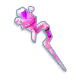 Wizard’s Force +10</td>
<td>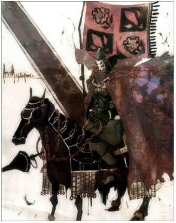 Abysmal Knight x2</td>
</tr>
<tr>
<td>Вторая рука</td>
<td>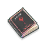 Sacrifice Book +10</td>
<td>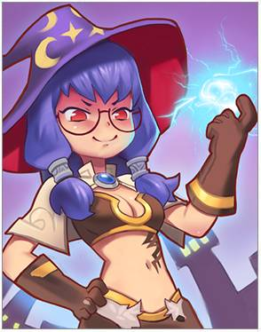 Telepathy Amplification</td>
</tr>
<tr>
<td>Накидка</td>
<td> Natto Kig’s Manteau +10</td>
<td>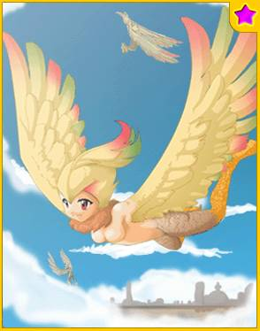 Harpy ★</td>
</tr>
<tr>
<td>Броня</td>
<td> Star Shatter’s Gown +10</td>
<td>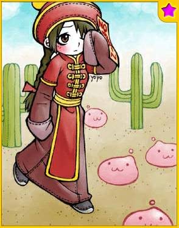 Munak ★</td>
</tr>
<tr>
<td>Ботинки</td>
<td> Crystal Pumps (IV) +8</td>
<td>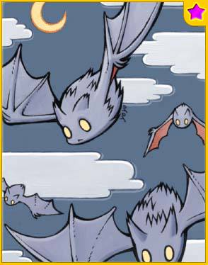 Familiar  ★</td>
</tr>
<tr>
<td>Аксессуар 1</td>
<td> Eye of Dullahan (VIII) +10</td>
<td>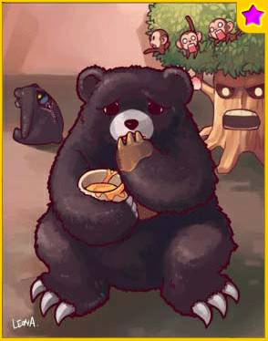 Zipper Bear  ★</td>
</tr>
<tr>
<td>Аксессуар 2</td>
<td>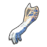 Orleans’s Gloves (VIII)</td>
<td> Zipper Bear  ★</td>
</tr>
<tr>
<td>Голова</td>
<td> Coif или  Wind Traveler</td>
<td>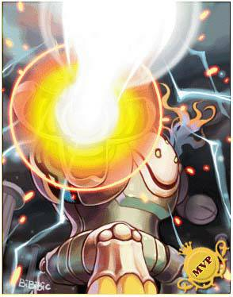 Sealed Apocalypse</td>
</tr>
<tr>
<td>Лицо</td>
<td>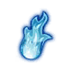 Evil Eye</td>
<td>-</td>
</tr>
<tr>
<td>Рот</td>
<td>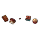 Ceremony - Spinning Sweet Dream или  Magic Bubble Gum</td>
<td>-</td>
</tr>
<tr>
<td>Спина</td>
<td>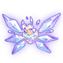 Ashy Star Flying Feather или 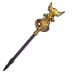 The Ancient One’s Staff</td>
<td>-</td>
</tr>
<tr>
<td>Хвост</td>
<td> Peter Wendy</td>
<td>-</td>
</tr>
</tbody>
</table>
Только предметы экипировки вам дадут вам 108% игнора Мдефа и 14% Магического проникновения. Вклад карты Sealed Apocalypse в справочник увеличит ваш Игнор Мдефа до 110%. Десятый уровень умения  Energy Coat даёт вам дополнительно 5% Игнора Мдефа, то есть вы уже достигли 115%.

Данный шмот - не минимальные требования. Этот шмот - средний шмот Варлока для Танатоса. Основная задача у Варлока - выдавать средний урон на 3 этаже и шотать Фриони на 4.

Далее разгонять Игнор нужно с помощью маленьких рун, чипов, дополнительной заточной снаряжения и, если вам повезёт, зачарованием второй руки, спины и лица. Каждое зачарование вам может дать до 20% игнора Мдефа.

Варлоки на третьем этаже могут наносить огромный урон, если им повезло получить дополнительную строчку на Soul Elegy Rune.

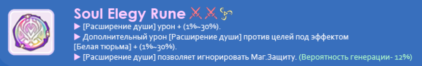

Данная строчка даёт вам полный игнор Магической защиты для умения  Soul Expansion. Если вам повезло достать эту руну, то вы можете одеваться так, чтобы по максимуму увеличить ваш MATK, полностью отказываясь от предметов на Игнор Мдефа. На четвёртом этаже данная руна бессмыслена, так как вы будете бить другим умением.

<h2 id="умения">Умения</h2>

 Recognized Spell (lvl 10)

 Soul Expansion (lvl 15)

 HP Absorb (lvl 10)

 White Imprison (lvl 5)

 White Barrier (lvl 6)

 Force Focus (lvl 10)

 Fast Reading Spell (lvl 5)

9 свободных очков

<h2 id="руны-в-монументе">Руны в монументе</h2>

Основные руны, которые нужно взять:

4 руны на HP  Absorb.

3 руны на нейтральный урон.

3 руны на урон гостом.

<h2 id="действия">Действия</h2>
<h3 id="третий-этаж">Третий этаж</h3>

На данном этаже вы внимательно смотрите на цвет зоны, где вам нужно находиться, и перемещаетесь туда.

Советую вам купить за очки приключений умение  Prepare  for  Elite. Оно существенно сократит время вашего обкаста и количество занимаемых слотов на панели.

Умения кастуются приблизительно в следующем порядке:

                 
 

Для удобства можете поставить умения на авто. Единственное - вам нужно нормально контролировать своего персонажа, чтобы вовремя выбегать из опасных зон.

 Prepare  for  Elite  перекастовывается по мере окончания действия умения  Energy  Coat.

Сначала всегда используется умение  White  Imprison, так как карта в вашей второй руке увеличивает на 20% урон  Soul Expansion на 5 секунд после применения White  Imprison.

При необходимости, если вам угрожает опасность, используйте  White Barrier.

<h3 id="четвёртый-этаж">Четвёртый этаж</h3>

Первая стадия босса достаточно лёгкая. Бейте его комбинацией с третьего этажа. Против мобов, которые иногда вылезают, очень хорошо использоваться  HP Absorb, так как мобы от неё шотаются.

Для второй стадии желательно иметь в альянсе двух визов, которые будут сменять друг друга. Порядок действий такой:

Один из визов при старте второй стадии находится вне круга и копит ярость. На 40% ярости он улетает вниз. Внизу основное умение –  HP  Absorb. И Бехолдеры, и Фриони шотаются этим умением. Ваша задача – как можно быстрее убивать Фриони. За один спуск вниз вы можете убить максимум две Фриони. Первую – приблизительно на 50% - 60% ярости. Вторую – на 90% - 98% ярости. Когда у вас накопилось 75% ярости, вы сообщаете об этом второму визу. Ни в коем случае вы не должны накопить 100% ярости. После убийства второй Фриони сразу же разговаривайте с НПЦ и выходите из другого мира. Если вдруг вы видите, что не успеваете убить вторую Фриони – выходите всё равно. Её может добить второй виз.

Второй виз всё это время находится на поверхности и бьёт Танатоса связкой скиллов с третьего этажа и мобов  HP  Absorb. Когда второй виз получает от первого информацию, что у первого виза накопилось 75% ярости, второй виз выходит за пределы круга и начинает копить ярость. На 40%, когда он улетит вниз, первый виз приблизительно в это время прилетает наверх. Цепочка замкнулась.

