

Материалы составлены гильдией "Лисы". Полный список гайдов и обсуждение нового эпизода в нашем дискорде: <a target="_blank" href="https://discord.gg/CK8mFcH"> https://discord.gg/CK8mFcH</a>

<h1 id="карты-местности-мобы-и-лут">Карты местности, мобы и лут</h1>

Эпизод 6 SP порадует игроков новыми локациями – город Ракель, Равнины Идуна, Святые Земли и Ледяная Пещера.

На данных локациях обитают новые мобы, из которых падает новый лут и, разумеется, карты.

Далее будет представлен карткий гайд по тому, как добраться до всех локаций, каких мобов там можно найти и какие бонусы дают новые карты.

Чтобы добраться до равнин Идуна необходимо использовать дирижабль, сесть на который можно в Излуде.

<h2 id="поле-лайтхайзена">Равнины Идуна</h2>

На этой карте вы столкнётесь со Stapo, Man-eating grass и Roween. Здесь же вас ожидает один мини босс (Galion) и один MVP (Hill Wind), который вернулся мстить игрокам за геноцид его собратьев в классической версии Рагнарока.

<table>
<thead>
<tr>
<th>Название</th>
<th>Информация</th>
<th>Карта</th>
</tr>
</thead>
<tbody>
<tr>
<td>
   
  Stapo 
  (Ур 133)
  </td>
<td>Бесформенный  Земля Маленький</td>
<td>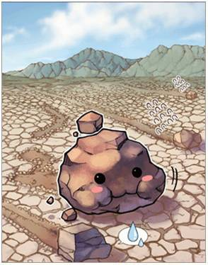 <strong>Вторая рука</strong>   <strong>Эффект:</strong>MDEF +30 Сопротивление окаменению +15% <strong>Депозит:</strong>  Макс ХП +36  <strong>Получение:</strong>  Atk +3</td>
</tr>
<tr>
<td>
   
  Man-eating grass 
  (Ур 135)
  </td>
<td>Растение Земля Средний</td>
<td>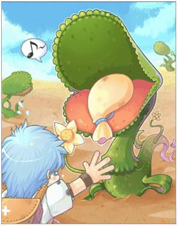 <strong>Вторая рука</strong>   <strong>Эффект:</strong>Поулчаемое лечение +5% При получении физического урона от умения, есть 10% шанс использовать умение Лечение 10-го уровня <strong>Депозит:</strong> MDEF +4.5 <strong>Получение:</strong> Поулчаемое лечение +1%</td>
</tr>
<tr>
<td>
   
  Roween 
  (Ур 137)
  </td>
<td>Брут Ветер Средний</td>
<td>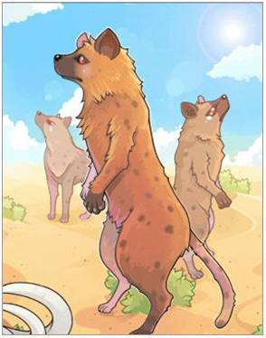 <strong>Накидка</strong>   <strong>Эффект:</strong>Flee +10 Урон по водным мобам +10% Крит против Рыб +20 <strong>Депозит:</strong>  Урона против Рыб +1%  <strong>Получение:</strong>  Макс ХП +60</td>
</tr>
<tr>
<td>
   
  Galion 
  (Ур 143)
  </td>
<td>Брут Ветер Средний</td>
<td>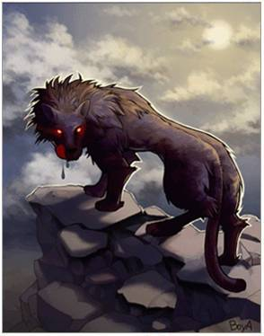 <strong>Аксессуар</strong>,   <strong>Эффект:</strong> HIT +50   Урон по водным мобам +20%   <strong>Депозит:</strong>  DEF+3 Макс ХП +36  <strong>Получение:</strong>MATK +8</td>
</tr>
<tr>
<td>
   
  Hill Wind 
  (Ур 147)
  </td>
<td>Брут Ветер Большой</td>
<td>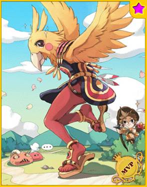 <strong>Оружие</strong>   <strong>Эффект:</strong>  Урон от Jupitel Thunder, Lightning Bolt, Lord of Vermilion и Thunderbolt +25%   <strong>Депозит:</strong>  Макс ХП +112   <strong>Получение:</strong>  АТК +12</td>
</tr>
</tbody>
</table>

С этой карты игрок может пройти в Ледяную Пещеру.

<h2 id="лайтхайзен">Ледяная пещера</h2>

Пещеру населяют водные мобы, мини босс (Gazeti) и МВП (Ktullanux)

<table>
<thead>
<tr>
<th>Название</th>
<th>Информация</th>
<th>Карта</th>
</tr>
</thead>
<tbody>
<tr>
<td>
   
  Little Siroma 
  (Ур 134)
  </td>
<td>Бесформенный Вода Маленький</td>
<td> <strong>Шапка</strong>   <strong>Эффект:</strong>  Фиксированное время каста умения Cold Bolt -0.2 сек Урон от умения Cold Bolt +10%  <strong>Депозит:</strong>  При экипировки с картой Siroma урон от Cold Bolt увеличивается на 2%  <strong>Получение:</strong>  Def +4.5</td>
</tr>
<tr>
<td>
   
  Siroma 
  (Ур 136)
  </td>
<td>Бесформенный Вода Большой</td>
<td> <strong>Броня</strong>   <strong>Эффект:</strong>Урон водным монстрам +15% Получаемный урон от водных монстров -5% <strong>Депозит:</strong> Max HP +72   <strong>Получение:</strong> MATK +3, Max HP +36</td>
</tr>
<tr>
<td>
   
  Marin 
  (Ур 138)
  </td>
<td>Растение Вода Средний</td>
<td> <strong>Ботинки</strong>   <strong>Эффект:</strong>VIT +3 Сопротивление страху +10% <strong>Депозит:</strong>  MDEF +3 <strong>Получение:</strong>  DEF +3</td>
</tr>
<tr>
<td>
   
  Gazeti 
  (Ур 142)
  </td>
<td>Бесформенный Вода Большой</td>
<td>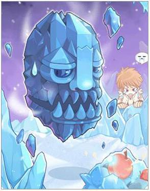 <strong>Ботинки</strong>,   <strong>Эффект:</strong>Скорость передвижения +3% Снижение урона +10% <strong>Депозит:</strong>  При экипировки с картой Gazeti скорость передвижения +2%   <strong>Получение:</strong>  MDEF +1%, DEF +1%</td>
</tr>
<tr>
<td>
  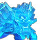 
  Ktullanux 
  (Ур 145)
  </td>
<td>Брут Вода Большой</td>
<td> <strong>Броня</strong>   <strong>Эффект:</strong>Урон огненным монстрам +25% Есть 10% шанс использовать Frost Nova при получении урона. <strong>Депозит:</strong>  Макс ХП +112   <strong>Получение:</strong>  МАТК +12</td>
</tr>
</tbody>
</table>
Следующая наша локация - сам город Ракель.

<h2 id="ракель">Ракель</h2>

В городе, как в большинстве других городов, отсутствуют мобы. Отсюда можной пройти в храм, где откроется доступ к Святым Землям.

<h2 id="второй-этаж-биологической-лаборатории-восточное-крыло">Святые Земли</h2>

Последняя локация в Ракеле. Подземелье, наполненное ужасными монстрами, и фанатиками. Здесь, как и на предыдущих локациях, обитает 1 мини босс (Fallen Bishop) и 1 МВП (Gloom Under Night)

<table>
<thead>
<tr>
<th>Название</th>
<th>Информация</th>
<th>Карта</th>
</tr>
</thead>
<tbody>
<tr>
<td>
   
  Hodremlin 
  (Ур 132)
  </td>
<td>Получеловек  Огонь  Средний</td>
<td>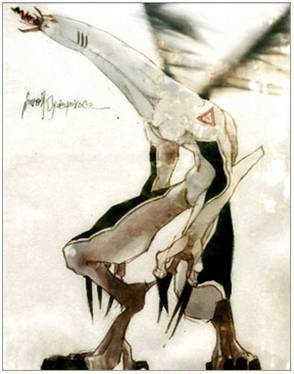 <strong>Накидка</strong>   <strong>Эффект:</strong>Макс ХП +100 Макс СП +100 <strong>Депозит:</strong>  Макс ХП +36  <strong>Получение:</strong>  MATK +3</td>
</tr>
<tr>
<td>
   
  Devil's Eye 
  (Ур 139)
  </td>
<td>Получеловек  Земля  Средний</td>
<td>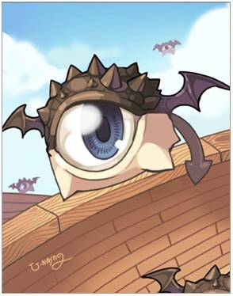 <strong>Броня</strong>   <strong>Эффект:</strong>  Макс ХП +200 Макс СП +2%  <strong>Депозит:</strong> MDEF +3 <strong>Получение:</strong> Макс ХП +10</td>
</tr>
<tr>
<td>
   
  Red Devil's Eye 
  (Ур 141)
  </td>
<td>Получеловек  Яд  Средний</td>
<td>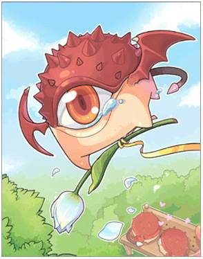 <strong>Оружие</strong>   <strong>Эффект:</strong>Урон по тёмным монстрам +20% <strong>Депозит:</strong> ATK +3, Макс ХП +36  <strong>Получение:</strong>Урон по тёмным монстрам +1%</td>
</tr>
<tr>
<td>
   
  Fallen Bishop 
  (Ур 144)
  </td>
<td>Демон  Тень  Маленький</td>
<td>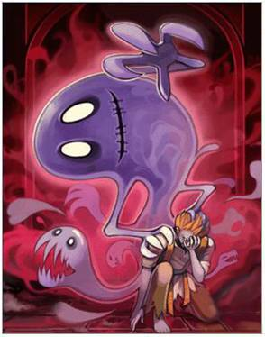 <strong>Ботинки</strong>,   <strong>Эффект:</strong>Урон по Полулюдям +15% Макс СП -30%  <strong>Депозит:</strong>  MDEF +3, Макс ХП +36  <strong>Получение:</strong>ATK +8</td>
</tr>
<tr>
<td>
   
  Gloom Under Night 
  (Ур 148)
  </td>
<td>Нежить  Нежить  Средний</td>
<td>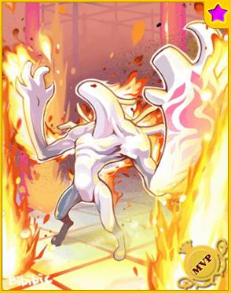 <strong>Броня</strong>   <strong>Эффект:</strong>Урон по святым и тёмным монстрам +15% Урон по ангелам и демонам +15% <strong>Депозит:</strong>  Урон по ангелам +2%   <strong>Получение:</strong>Урон по святым монстрам +2%</td>
</tr>
</tbody>
</table>
