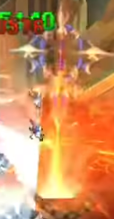
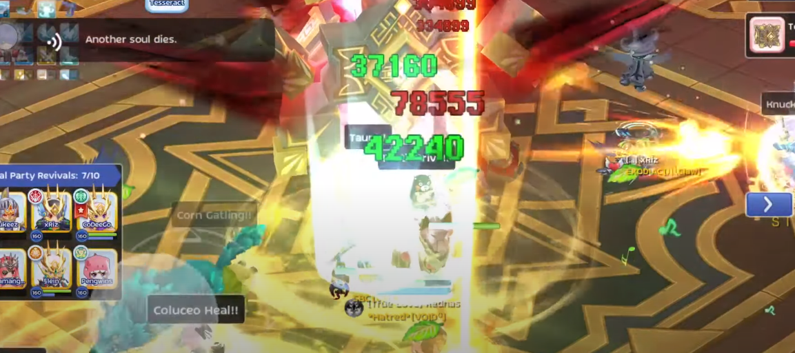

Материалы составлены гильдией "Лисы". Полный список гайдов в нашем дискорде: <a target="_blank" href="https://discord.gg/CK8mFcH"> https://discord.gg/CK8mFcH</a>

<h1 id="гайд-по-ТТЛ">Гайд по ТТЛ</h1>

Данный гайд - общее описание механик на легендарном уровне сложности Башни Танатоса. На каждом этаже башни примерно раз в 30 секунд проходит очищающая волна, которая снимает баффы, убирает трапы, пиллары и т.п. Не забывайте снова прожимать Подготовку к Элите после прохода такой волны.

<h2 id="первый-этаж">Первый этаж</h2>

Важные умения Валькирии:

<ul>
<li>

<strong> Death Penalty</strong> - Наносит большой физический урон цели. Выглядит как огромный меч, который падает на персонажа.

</li>
<li>

<strong>Undying Flame</strong> - оставляет под собой огненную лужу, которая наносит большой огненный урон, если в ней стоит персонаж. Если валькирия стоит в этой лужи, то она получает энергию.

</li>
<li>

<strong>Cage</strong> - накладывает на одного персонажа цепи. Через 5 секунд после наложения персонаж будет иммобилизован на 999 секунд. Снять это умение можно только оказавшись в огненной луже валькирии. DA могут временно (9 секунд) позволить игроку двигаться, если используют умение  Freedom Vow.

</li>
<li>

<strong>Bladesoul Slash</strong> - валькирия призывает трёх своих клонов и использует умение, которое бьёт персонажей впереди себя и своих клонов. Данное умение можно избежать, если стоять в пневме ( Light Shield).

</li>
</ul>

На данном этаже в зависимости от вашей профессии, у вас будут разные роли.

<h3 id="танки">Танки</h3>

Первый танк должен водить валькирию, второй танк водит мобов. Танк на валькирии инициирует битву, подходя к валькирии, когда остальные будут готовы. Сразу после того, как уровень начался, танк бежит в левый верхний угол. Валькирия прилетит к нем секунд через 5. Делается это для того, чтобы валька оставила в углу свою огненную лужу, которая нужна будет персонажу на чейн бейте, чтобы снимать цепи. Когда валька оставила лужу, танк начинает её водить в правой верхней и центральной верхней части карты. Основные задачи: не умирать, не допускать срыва вальки на патьку или на чейн бейта, не позволять вальке стоять в собственных огненных лужах. После окончания первой стадии танк водит валькирию около платформы, на которой стоит остальная пати. На этой стадии самое важное - не допускать срыва валькирии на остальную патьку.

Второй танк водит мобов к нужным кристаллам. Мобы должны исключительно висеть на танке, нельзя допускать агра моба на какого-нибудь другого персонажа из пати. После подведения моба в кристалл и убийства кристалла, патька начинает бить моба. Когда у моба остаётся половина жизней, прист должен кинуть танку молитву, так как смерть моба наносит фиксированный урон в 10кк, который пережить невозможно. Последним уничтожается один из верхних кристаллов! На второй стадии второй танк должен внимательно следить за первым и занимать его место в случае, если тот умирает.

<h3 id="чб">Чейн бейт</h3>

Чаще всего для этого используются визы, но и присты в состоянии осуществлять это действие. При заходе в башню персонаж, который должен быть чейн бейтом не прожимает кнопку "Готов", и пати входит без него. Когда вся патька вошла, чейн бейт заходит в башню сам, нажав "следовать" на какого-нибудь человека в своей патьке.

Когда танк агрит вальку, он должен подвести её в самом начале в левый верхний угол. Валька оставит на своём месте огненную лужу.

Если чейн бейт зашёл в башню последним, то на него должны вешаться цепи (умение Cage). Чтобы данный эффект не активировался, чейн бейт должен через 3 секунды после появления цепей вбежать в лужу, оставленную Валькой. В луже наносится очень большой урон. Чтобы там выжить, нужно поддерживать постоянный приток или прожимать барьер (для АМ). Вы на секунду попадаете в оковы, потом, под действием лужи, сразу из них выходите. Когда это произошло - выбегайте из лужи и ждите следующую.

<h3 id="биши">Биши</h3>

Основная задача биша на данном этаже - ставить пневму ( Light Shield), чтобы патька не умерла от клонов валькирии, и вешать молитву на танка, когда будут взрываться мобы на кристаллах. Не ставьте пневмы около стен! Иногда игра неправильно это воспринимает, пневма попадает в текстуры и не работает. Пневма должна находиться на патьке всегда, чтобы минимизировать несчастные случаи.

На второй фазе все остаются около последней платформы и встают на последнюю ступеньку лестницы. Прист предварительно ставит на эту точку пневму, которая служит ориентиром для остальных членов патьки. На этой фазе пневма обновляется постоянно. Если требуется, то можно вешать на танка молитву для более комфортного прохождения.

<h3 id="ДД">ДД</h3>

ДДшники ходят вместе с пристами, постоянно вставая в пневмы, чтобы избежать атаки валькирии. Движение происходит исключительно по низу карты (буквой U), чтобы исключить возможность агра валькирии от первого танка. Ни один из ДД не должен стоять в центре карты, так как он может случайно сагрить моба при его появлении, который игрока шотнет. Пока танк ведёт моба, ДДшники уничтожают защиту кристалла. Когда танк с мобом стоят на кристалле, ДДшники убивают моба. После убийства моба все ДД стоят на месте. Танк сам бежит в центр, чтобы сагрить следующего моба.

На второй фазе все остаются около последней платформы и встают на последнюю ступеньку лестницы. Прист предварительно ставит на эту точку пневму, которая служит ориентиром для остальных членов патьки. Все нажимают кнопку "Оставаться бдительным" и выделяют валькирию. В случае если валькирия всё-таки сорвалась на патьку и успела поставить свою лужу, вам нужно незамедлительно отойти немного вглубь платформы.

<h2 id="второй-этаж">Второй этаж</h2>

Важные умения Тессеракта:

<ul>
<li>

<strong> Watcher's chains</strong> - Связывает двух персонажей нитью. Чем больше расстояние, тем больший урон получают цели. Если расстояние слишком большое, то цели может шотнуть сразу после связки.

</li>
<li>

<strong>Arcane Rend</strong> - вертикальные лучи, которые преследуют двух персонажей. Урон достаточно большой, поэтому рекомендуется, что человек, за которым идёт этот луч, не стоял в патьке, а бегал отдельно от них, но не слишком далеко, чтобы не убила возможная связка.

</li>
<li>

<strong>Arcane Bomb</strong> - два АоЕ взрыва, которые наносят очень большой урон через 5 секунд после каста. Выбегайте из них как только они появляются.

</li>
</ul>

Тессеракт не будет агриться по тех пор, пока его не начать бить, что вам позволит правильно встать. Все должны встать в чёрный квадрат под тессерактом, чтобы никто не умер, если его свяжут с кем-то из пати.

После того, как танк сагрил босса, все его начинают бить. Если вас с кем-то связало, встаньте как можно ближе к этому человеку. Если за вами следует луч - убегайте от него, но не убегайте слишком далеко от патьки. Определите сразу человека, который будет уничтожать гравитационные тела при их появлении. Когда около Тессеракта находится хотя бы один человек, то ему иногда может быть нанесён большой сингл-таргет урон. Если же около Тессеракта нет никого, то он наносит большой урона сразу всему альянсу, что может убить всех его членов. Если Тессеракт кастует под себя взрыв, то хорошо, если танки этот взрыв могут пережить. Если нет, то не оставляйте его без людей рядом с ним надолго.

На второй фазе Тессеракта нужно оставить одного самого живучего танка. Если вы остались живы к моменту перехода босса во вторую фазу, вам нужно умереть как можно быстрее, чтобы танка не связало с вами ниткой, которая может шотнуть вас и его. Когда вы умерли, можете перейти в режим камеры и подсказывать танку места, где лежат ключи.

<h3 id="третий-этаж">Третий этаж</h3>

На данном этаже тактика схожа с тактикой в ТТБ, но добавились три механики, которые несколько усложняют жизнь:

<ul>
<li>

Внутренний и внешний круг делятся на два сектора каждый. В этих секторах происходят взрывы, которые снимают игрокам около 90% хп. Желательно выбегать из них, если у вас нет полной уверенности, что вы переживёте этот урон. 

</li>
<li>

 Столб (пиллар). Появляется по периметру внутреннего сектора. Когда столб активен, боссы бессмертны. Необходимо уничтожить его как можно быстрее.

</li>
<li>

 Когда вы уничтожаете сердце, при движении вы получаете сильный урон, поэтому используйте еду/хиляющие умения.

</li>
</ul>

На этом этаже есть смысл дать пристовскую сферу одному самому хорошему и мобильному ДД, который будет находиться во внутреннем секторе и при появлении уничтожать сердца и столбы. Вся остальная механика из ТТБ сохраняется в полном объёме. Из всех красных зон выбегайте, если на вас повесили АоЕ, то не скрещивайте зоны с другим членом группы, на котором тоже висит АоЕ. Перемещайтесь к сердцу заранее, если оно очень далеко от вас, вне зависимости от того в вашей или не в вашей зоне произойдёт взрыв, так как вам может сменить цвет зоны и до своего сектора вы просто не добежите.

<h3 id="четвертый-этаж">Четвертый этаж</h3>

Единственное существенное отличие четвёртого этажа ТТЛ от четвёртого этажа ТТБ - иногда на первой фазе игроков будет ловить в цепи. Они выглядят как зелёные кружки под персонажем . Чтобы освободить человека от цепей, трём людям необходимо встать в этот зелёный кружок. На этом этаже взрывы происходят чаще, а кругов больше.

Вторая фаза ТТЛ ничем не отличается от второй фазы ТТБ. Визы начинают чередоваться на Фрионьках, остальная патька сливает Танатоса.

На третьей фазе помимо пристки за вами будет бегать намного больше мобов, которые будут вас больно кусать и копить вам ярость , а на земле появляется ещё больше луж, которых нужно избегать.

