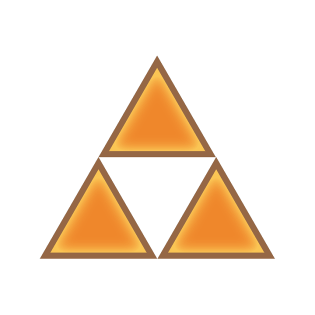
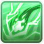
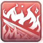
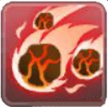

Материалы составлены гильдией "Лисы". Полный список гайдов в нашем дискорде: <a target="_blank" href="https://discord.gg/CK8mFcH"> https://discord.gg/CK8mFcH</a>

<h1 id="гайд-по-ТТЛ-для-аркан-мастеров">Гайд по ТТЛ для Аркан Мастеров</h1>

Данный гайд составлен для целей его использования Аркан Мастерами при прохождении ТТЛ.

<h2 id="экипировка">Экипировка</h2>

В Башне Танатоса против всех мобов необходимо иметь 200% игнора Мдефа, чтобы наносить полный урон. Необходимо стремиться к этому числу, так как приближение к нему даёт экспоненциальное увеличение урона. Экипировка в целом не отличается от экипировки, указанной в <a target="_blank" href="https://rom-foxes.github.io/info/guide/ep6/general/thanatos/wizard/"> гайде по Танатосу для Варлоков</a> 

<h2 id="действия">Действия</h2>
<h3 id="первый-этаж">Первый этаж</h3>

На данном этаже задача АМ - чейн бейт. При заходе в башню АМ не прожимает кнопку "Готов". Пати входит без АМ. Когда вся патька вошла, АМ заходит в башню сам, нажав "следовать" на какого-нибудь человека в своей патьке.

Когда танк агрит вальку, он должен подвести её в самом начале в левый верхний угол. Делается это для того, чтобы АМ было удобно стоять и не приходилось уворачиваться от АоЕ вальки. Валька оставит на своём месте огненную лужу.

Если АМ зашёл в башню последним, то на него должны вешаться цепи. Над персонажем появляется вот такая иконка: 

Это значит, что примерно через 5 секунд персонаж не сможет двигаться 999 секунд. Чтобы данный эффект не активировался, АМ должен через 3 секунды после появления цепей вбежать в лужу, оставленную Валькой, и прожать барьер. Это позволит вам прекратить получать урон от лужи, который может быть достаточно большим. Вы на секунду попадаете в оковы, потом, под действием лужи, сразу из них выходите. Когда это произошло - выбегайте из лужи и ждите следующую.

Как обычно, вторая фаза возникает, когда все кристаллы были уничтожены. Последний кристалл, который уничтожен, должен быть верхним, чтобы сократить дистанцию бега АМ до него. Вы встаёте в одну точку на платформе с кристаллом. Все должны встать в одну точку, чтобы пневма работала на всех сразу. Обязательно нажмите "Оставаться бдительным", чтобы не сбежать с точки. На этом этапе в патьке должен быть саг, который будет конвертить Валькирию в воду. Ветер по Валькирии будет наносить двойной урон. Вешайте на валькирию Lighnting Rod , который вы берёте в памятнике. Бьёте Wind Blade , Lighnting Meteor , Sand Storm . Обязательно возьмите пассивки в скиллах АМ , , . Не ставьте Lighnting Rod  на авто, так как кастовать он её будет часто, а вам тут важно, чтобы эффект действовал, так как скилл наносит очень маленький урон.

<h3 id="второй-этаж">Второй этаж</h3>

Здесь в ваш автослот могут добавиться пиллары. Поставьте в авто Flame Route . Под конвертом в воду они будут наносить не такой большой урон, как хотелось бы, но всё равно неплохо. А ещё у вас будет поглощение магического и физического (если есть руна с доп. строчкой) урона. Вставайте на Тессеракта, как только танк агрит, используйте барьер , чтобы не умереть от волны, которую тот пускает, и начинайте давать в него прокаст. Взрывы избегаются барьером, так что вы можете с босса даже никуда не уходить.

На второй фазе рекомендуется оставить одного танка, так как ему будет удобнее всего наскать ключи. Если вы остались живы к моменту перехода босса во вторую фазу, вам нужно умереть как можно быстрее, чтобы танка не связало с вами ниткой, которая может вас шотнуть.

<h3 id="третий-этаж">Третий этаж</h3>

Тут уже конверт от сага не обязателен. Вставляйте в авто Flame Route , Wind Blade , Sand Storm , МШ (2-й уровень) . Стойте всегда на боссе на авто. В опасных ситуациях - прожимайте барьер . На сердца и на пиллары неуязвимости не отвлекайтесь. Их убьют другие члены патьки, так как вам нужно время, чтобы разогнать свой максимальный урон.

<h3 id="четвертый-этаж">Четвертый этаж</h3>

Умения сходятся с третьим этажом. На панельку нужно вынести HP Absorb , так как на второй фазе нужно будет сливать Фрионек. На первой фазе, как и на предыдущем этаже, вы стоите на Танатосе и даёте свой прокаст, иногда перебегая от опасных зон. На первой фазе иногда игроков будет ловить в цепи. Они выглядят как зелёные кружки под пресонажем.

Чтобы освободить человека от цепей, трём людям необходимо встать в этот зелёный кружок.

